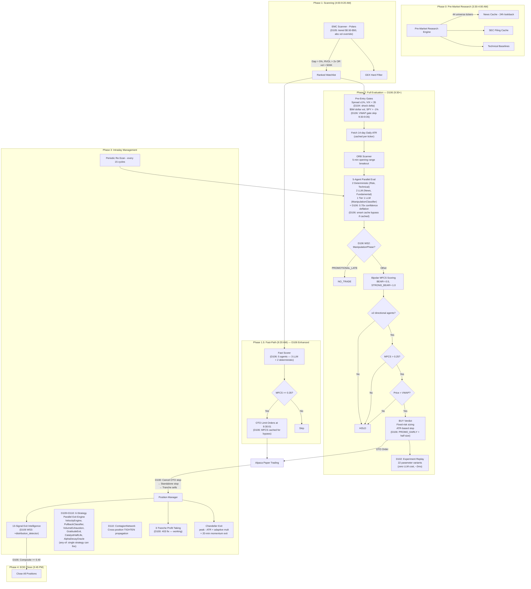
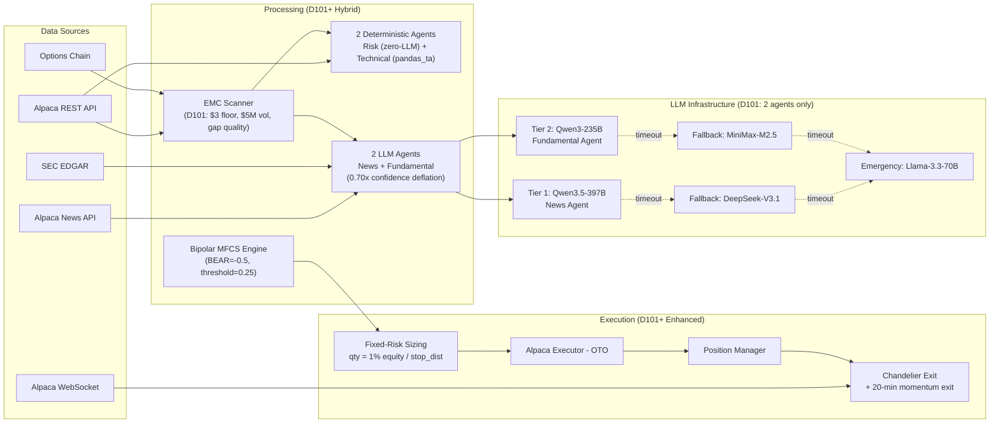
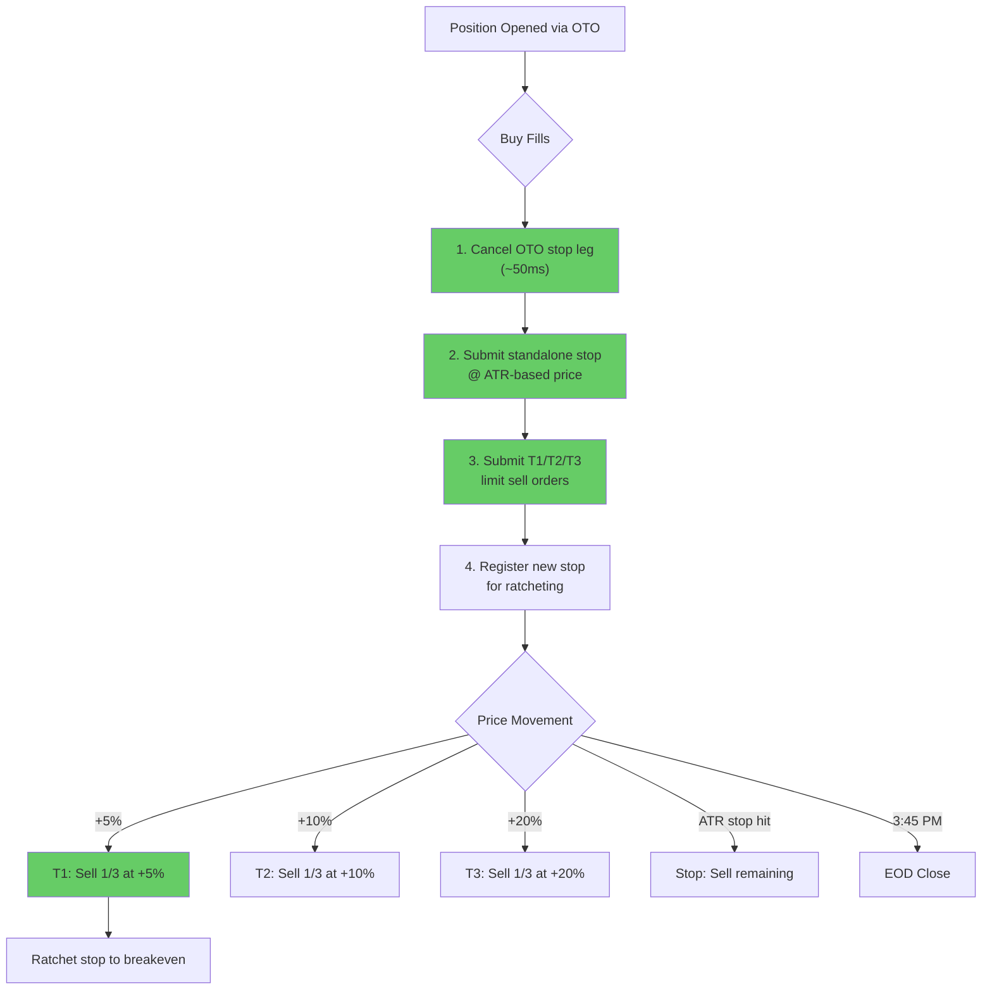
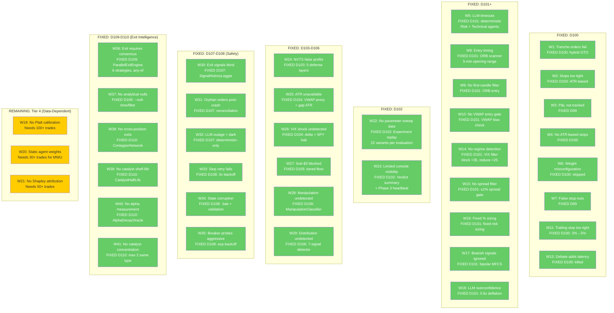

# Momentum-X Profitability Assessment & Path Forward

> **NOTE (2026-04-06)**: This document was written at D120/D121. The system is now at **D210** (~$142K equity). The root causes listed below have been substantially addressed. See README.md for current system state, and PAPER_TRADING_LOG.md for ongoing observations.

**Date**: March 10, 2026 (Day 14)
**Last Updated**: March 21, 2026 (D121: 13 cross-system bug fixes, D120: Strategy Arena evolved profiles + deployment recommendation)
**Account**: $139,449.15 (started ~$100,000, peak ~$149,000)
**Net P&L**: ~+$39,449 (largely from Day 1 + overnight drift, NOT systematic alpha)
**Systematic Trading P&L (Days 11-16)**: Estimated **-$4,700** (all stop-outs Days 11-13, 0 trades Days 14-16; Day 16 missed BMNR +12%)
**Test Suite**: 1,939 tests passing

---

## 1. Executive Summary

Momentum-X correctly identifies explosive momentum candidates. The scanning pipeline, agent evaluation, and candidate selection are fundamentally sound. However, **the system has never successfully captured a profitable exit through its own exit mechanism.** Every gain has come from either Day 1's manual-era trades or accidental overnight position drift (RLMD). Every systematic trade in Days 11-14 ended in a stop-out.

A comprehensive system critique on Day 14 scored the system 5.2/10 and identified 5 root causes blocking profitability. **All 5 were fixed in D100, then 17 additional improvements implemented in D101+ (Tiers 1-3). D102-D106 added experimentation, resilience, scanner enhancements, and manipulation detection.**

**D107+ NOTE**: "FIXED" means code is deployed and tests pass. It does NOT mean the fix has been validated in live trading. See Validation column: DEPLOYED = code merged | OBSERVED = behavior confirmed in logs | VALIDATED = statistically significant improvement measured (N≥20 trades). The graduation criteria (GAPS_AND_ROADMAP.md §12) require 15 days of stable operation before any fix can move from DEPLOYED to VALIDATED.

| # | Root Cause | Fix | Status | Validation |
|---|-----------|-----|--------|------------|
| 1 | Tranche 403 bug | Hybrid OTO-to-standalone stop conversion | **FIXED D100** | DEPLOYED |
| 2 | Stops too tight (5.5%) | ATR-based stops: `entry - max(2.0 * ATR_14d, 4%)` | **FIXED D100** | DEPLOYED |
| 3 | Debate engine (0% conversion) | Killed: `max_debate_attempts=0` | **FIXED D100** | DEPLOYED |
| 4 | NEUTRAL=0.4 inflating MFCS | Full bipolar: BEAR=-0.5, STRONG_BEAR=-1.0 | **FIXED D101** | DEPLOYED |
| 5 | No backtesting | `scripts/backtest.py` with historical gap scanning | **BUILT D100** | DEPLOYED |
| 6 | LLM agents fail 20-40% | Deterministic Risk + Technical (zero LLM) | **FIXED D101** | DEPLOYED |
| 7 | No spread/liquidity filter | Spread ≤1%, $3 price floor, $5M dollar volume | **FIXED D101** | DEPLOYED |
| 8 | Fixed % sizing ignores risk | Fixed-risk: `qty = 1% equity / stop_distance` | **FIXED D101** | DEPLOYED |
| 9 | No entry timing filter | 5-min ORB + VWAP directional bias | **FIXED D101** | DEPLOYED |
| 10 | No regime detection | VIX filter: block >35, reduce >25 | **FIXED D101** | DEPLOYED |
| 11 | NVTS false profit on exit | 5 defense layers (post-trade, Shapley, session) | **FIXED D103** | DEPLOYED |
| 12 | ATR data unavailable for new tickers | Graceful fallback: VWAP proxy + gap-based ATR | **FIXED D104** | DEPLOYED |
| 13 | Macro shocks (VIX +35%) undetected | VIX shock delta + SPY halt gate + confidence decay | **FIXED D104** | **OBSERVED** |
| 14 | Sub-$3 movers blocked (BIAF +114%) | Tiered price floor: $0.50 + $10M dolvol + 5x RVOL | **FIXED D105** | DEPLOYED |
| 15 | RVOL blocks perpetually active names | Absolute volume override: 500K premarket bypass | **FIXED D105** | DEPLOYED |
| 16 | $20 ceiling blocks mid-cap gaps | Price ceiling raised $20 to $50 | **FIXED D105** | DEPLOYED |
| 17 | LLM deflation 0.6x too aggressive | Raised to 0.70x; 0.80→0.56 not 0.48 | **FIXED D106** | DEPLOYED |
| 18 | Exit threshold 0.60 impossible | Lowered to 0.40 (5 signals not 8) | **FIXED D106** | DEPLOYED |
| 19 | VWAP fallback auto-rejects all day | Returns None (no opinion) when WebSocket down | **FIXED D106** | DEPLOYED |
| 20 | VWAP gate blocks 9:30 entries | Skipped 9:30-9:35 ET (VWAP undefined) | **FIXED D106** | DEPLOYED |
| 21 | Fast-path only 50% MFCS (3 agents) | Extended to 5 agents (100% weight) | **FIXED D106** | DEPLOYED |
| 22 | Full LLM re-eval at 9:30 (~45s) | Smart cache bypass: reuse LLM, re-run deterministic | **FIXED D106** | DEPLOYED |
| 23 | Organic/promotional treated same | ManipulationClassifier (Tier 1 LLM): 4-phase lifecycle | **FIXED D106** | DEPLOYED |
| 24 | No filing-based risk detection | SEC filing summary: S-3 age, 424B5 same-day, insider sells | **FIXED D106** | DEPLOYED |
| 25 | PROMOTIONAL_LATE entered as trades | PROMOTIONAL_LATE → automatic NO_TRADE | **FIXED D106** | DEPLOYED |
| 26 | PROMOTIONAL_EARLY full position | Half position, 1.5x ATR stop, +3/+6/+10% targets, $500 floor | **FIXED D106** | DEPLOYED |
| 27 | No post-entry distribution detection | DistributionDetector: 7 signals, <1ms, composite > 0.50 → exit | **FIXED D106** | DEPLOYED |
| 28 | Exit intelligence dead signals (L2/tick) | Zeroed distribution + flow_toxicity, added distribution_detector (0.15) | **FIXED D106** | DEPLOYED |
| 29 | No exit signal diagnostics | SignalHistoryLogger: 13 signals per cycle as JSONL | **FIXED D107** | DEPLOYED |
| 30 | Orphaned orders after crash | Orphan reconciliation: cancel untracked orders at startup | **FIXED D107** | DEPLOYED |
| 31 | System reliability unmeasured | Reliability score: sessions_with_trades / attempted | **FIXED D107** | DEPLOYED |
| 32 | LLM outage = no trading | Deterministic-only mode: DeterministicTechnical + Risk + RVOL | **FIXED D107** | DEPLOYED |
| 33 | No external liveness check | Heartbeat webhook: dead man's switch for scheduling | **FIXED D107** | DEPLOYED |
| 34 | Stop resubmit fails silently | 3x retry loop with exponential backoff (1s, 2s, 4s) | **FIXED D108** | DEPLOYED |
| 35 | State file corruption = cold start | .bak rotation: shutil.copy2 before write, 3-level fallback | **FIXED D108** | DEPLOYED |
| 36 | Post-crash state corruption silent | Post-merge validation: clamp + warn on impossible state | **FIXED D108** | DEPLOYED |
| 37 | Circuit breaker probes too aggressive | Exponential backoff: doubles each re-trip, caps at 300s | **FIXED D108** | DEPLOYED |
| 38 | Metrics lost on crash | Disk snapshots: every 5th Phase 3 cycle, 200-file rotation | **FIXED D108** | DEPLOYED |
| 39 | No session completion alerts | Post-session webhook: POST JSON summary to configurable URL | **FIXED D108** | DEPLOYED |
| 40 | Trade journal reasoning truncated | Reasoning cap increased 500→1500 chars | **FIXED D108** | DEPLOYED |
| 41 | No analytical null hypotheses | Backtest --null-time, --null-filter, --anti-signal | **BUILT D109** | DEPLOYED |
| 42 | No per-trade MFE/MAE tracking | MFE/MAE tracking per trade (Exit Autopsy Phase 1) | **BUILT D109** | DEPLOYED |
| 43 | Trade data locked in JSONL | SQLite post-session ETL (6 tables, 3 materialized views) | **BUILT D109** | DEPLOYED |
| 44 | Exit requires consensus (7-8 signals) | ParallelExitEngine: 4→6 independent strategies, any-of architecture | **BUILT D109+D110** | DEPLOYED |
| 45 | No information-side exit timing | CatalystHalfLifeStrategy: shelf-life per catalyst type | **BUILT D110** | DEPLOYED |
| 46 | No cross-position exit correlation | ContagionNetwork: correlated position TIGHTEN propagation | **BUILT D110** | DEPLOYED |
| 47 | No remaining-alpha measurement | AlphaDecayOracle v1: observed vs null return curve | **BUILT D110** | DEPLOYED |
| 48 | Correlated catalyst concentration | Max 2 positions with same catalyst type at entry | **BUILT D110** | DEPLOYED |
| 49 | D110 config params not wired to engine | Half-life table, null curve, contagion params forwarded | **FIXED D111** | DEPLOYED |
| 50 | ExecutionBridge spread filter dead | Spread filter re-enabled (was missing client/settings) | **FIXED D111** | DEPLOYED |
| 51 | Phantom stop on full fill | Block stop resubmit when remaining_qty=0 | **FIXED D111** | DEPLOYED |
| 52 | Stop ratchet-UP not enforced | Enforce invariant at assignment point | **FIXED D111** | DEPLOYED |
| 53 | DST-unaware RVOL volume profile | Use `zoneinfo` for EDT/EST-aware market open | **FIXED D111** | DEPLOYED |
| 54 | Alpha Oracle wrong time reference | Use minutes_since_open (market time) not hold time | **FIXED D111** | DEPLOYED |
| 55 | ManagedPosition missing D110 fields | Add catalyst_type, sector, gap_pct with defaults | **FIXED D111** | DEPLOYED |
| 56 | Catalyst/sector data not wired at entry | Bridge passes scored candidate data to ManagedPosition | **FIXED D111** | DEPLOYED |
| 57 | Pipeline wastes LLM on obvious rejects | AdaptiveComputeRouter: 3-tier depth routing (instant/det/full) | **BUILT D112** | DEPLOYED |
| 58 | Heartbeat timeout during long evaluations | D113: Pulse calls in Phase 1, Phase 2, and main loop | **FIXED D113** | DEPLOYED |
| 59 | News agent too strict — missed gap-and-go catalysts | D114: CORPORATE_UPDATE/SECTOR_CATALYST types, softened NEUTRAL override | **FIXED D114** | DEPLOYED |
| 60 | Flat 1% risk regardless of conviction | D115: Tiered Kelly Criterion (1-5% risk, 4 tiers, shadow mode) | **BUILT D115** | DEPLOYED |
| 61 | No per-catalyst exit tuning | D118: Entry Catalyst Profiler — durability-aware half-life, ATR, decay | **BUILT D118** | DEPLOYED |
| 62 | No systematic strategy comparison | D119: Strategy Simulation Arena — 12 profiles, Elo tournament, counterfactual | **BUILT D119** | DEPLOYED |
| 63 | Only 12 strategy variations tested | D120: +10 profiles (6 evolved + 4 ablation), 4 new dimensions unlocked | **BUILT D120** | DEPLOYED |
| 64 | MFCS scaling denom never optimized | D120: `mfcs_scaling_denom=0.35` crowned champion (Elo 1450, +24% on ANNA) | **FOUND D120** | **DEPLOY NEXT** |

The path to profitability now depends on (see `docs/GAPS_AND_ROADMAP.md` for full analysis):
1. ~~**Entry timing**~~ — **D106 WS1**: 5-agent fast-path + smart cache bypass + VWAP gate fixes
2. ~~**Entry latency**~~ — **D112**: Adaptive Compute Router halves per-cycle time (Tier 1/2 skip LLM)
3. ~~**Exit calibration**~~ — **D106 WS1**: exit_threshold 0.60→0.40, exit_tighten 0.20→0.15
4. ~~**Exit intelligence architecture**~~ — **D109+D110**: 6-strategy parallel engine + contagion + alpha oracle
5. ~~**Signal-quality sizing**~~ — **D115**: Tiered Kelly Criterion (shadow mode, 4-tier 1-5% risk scaling by conviction)
6. **ATR calibration** — Sweep stop multipliers with D102 framework
7. ~~**Manipulation detection**~~ — **D106 WS2-WS3**: ManipulationClassifier + DistributionDetector
8. **Post-freeze activation** — `parallel_strategies_active=True` for any-of exit override
9. **Kelly activation** — `KELLY_ENABLED=true` after 5+ shadow-mode observation sessions
10. **Data collection** — Accumulate 30-100+ trades for Tier 4 data-dependent optimizations
11. ~~**Strategy optimization**~~ — **D119+D120**: Arena tournament identified `aggressive_all + mfcs_scaling_denom=0.35` as optimal. See `docs/research/STRATEGY_ARENA_FINDINGS.md`

---

## 2. Performance History

### Day-by-Day Results

| Day | Date | Equity | Trades | P&L | Outcome |
|-----|------|--------|--------|-----|---------|
| 1 | Feb 10 | $109,372 | 2+ | +$9,000 | Strong debut (BRLS, RITR) |
| 2 | Feb 11 | ~$101,000 | 2/21 filled | -$8,000 | 403 errors, overnight carries |
| 3 | Feb 12 | ~$99,800 | 5 | -$1,200 | |
| 4 | Feb 20 | ? | 3 | ? | |
| 5 | Feb 24 | ~$100,500 | 6 | +$739 | 1.7% capture rate |
| 6 | Feb 25 | ~$100,600 | 5 | +$81 | 0.3% capture rate |
| 7-10 | Feb 26-Mar 3 | ? | 0 | $0 | System non-functional |
| 11 | Mar 4 | $149,022 | 0 | $0 | Market hours bug |
| 12 | Mar 6 | $140,526 | 4 | -$1,900 est | All stopped out |
| 13 | Mar 9 | $138,628 | 6 | -$2,733 est | 4 stop-outs (1 false) |
| 14 | Mar 10 | $139,864 | 0 | $0 | Process killed at 7:34 AM |
| 15 | Mar 12 | $139,449 | 0 | -$415 | D103-D104 deployed. VIX shock +35% detected, SPY -1.52% halt triggered. System correctly blocked entries on worst selloff day. Market-wide loss from overnight drift. |
| 16 | Mar 13 | $139,449 | 0 | $0 | D105 deployed post-close. NOK only candidate (gap 5.9%, RVOL 2.6x, MFCS 0.147 < 0.15 threshold). System sat on hands while BIAF +114%, AIFF +44%, ISPC +59% were all sub-$3 and blocked by price_min=$3.00. D105 fixes this. |

### Key Statistics

- **Days system actually traded**: 7 out of 16
- **Days with 0 trades (bugs/errors)**: 9
- **Win rate (Days 11-16)**: 0% (0 wins, 10 stop-outs)
- **Average hold time**: ~15 minutes before stop-out
- **Tranche exits completed**: 0 (T1/T2/T3 never fired)
- **Smart exits (D78)**: 0 (exit intelligence never triggered an exit)
- **Overnight carries (unintended)**: 3 (RITR D1, RLMD D13, others)
- **D104 regime blocks (correct)**: 1 (Day 15: VIX shock + SPY halt)
- **D105 missed movers (pre-fix)**: 6 (Day 16: all sub-$3, now admitted with D105)

---

## 3. System Architecture (Post-D110)

**Key architecture changes (D100 through D105):**
- **Deterministic agents** (D101): Risk and Technical agents replaced with zero-LLM Python implementations (0% failure rate, microsecond latency). Only News and Fundamental remain as LLM agents.
- **Bipolar MFCS** (D101): BEAR=-0.5, STRONG_BEAR=-1.0 -- bearish signals actively subtract from the score. Negative MFCS possible.
- **Confidence deflation** (D101→D106): **0.70x** multiplier on LLM-only confidence scores (KalshiBench: LLMs overconfident, ECE 0.12-0.40). D106: Raised from 0.6x — old value compressed scoring range to [0, 0.6]. Deterministic agents bypass deflation entirely (duck-typed, not BaseAgent subclasses).
- **Pre-entry gates** (D101+D104): Spread <=1%, VIX < 35, VIX shock delta < 15% (D104), SPY > -1% (D104), $5M minimum dollar volume, VWAP directional bias, minimum 2 directional agents.
- **Fixed-risk sizing** (D101): `qty = floor(equity * 1% / stop_distance)` -- normalizes dollar risk across volatility profiles.
- **ORB entry** (D101): 5-minute opening range breakout timing (Zarattini et al., 2.4 Sharpe).
- **Chandelier exit** (D101): `stop = peak - ATR * adaptive_multiplier` (1.5x/2.0x/3.0x by volatility regime).
- **20-minute momentum exit** (D101): Cuts positions that haven't moved 1R within 20 minutes.
- **D102 Experiment replay**: After each evaluation, replays the same agent signals through 22 parameter variants at zero LLM cost (~2ms overhead). Results logged to JSONL experiment journal.
- **D103 Post-trade defense**: 5 layers protecting against NVTS-type false profit reporting (fill verification, P&L sanity, Shapley bounds, journal cross-ref, session reconciliation).
- **D104 Macro regime awareness**: VIX shock detection (daily delta > 15%), SPY halt gate (< -1%), ATR data resilience (VWAP proxy + gap-based fallback for new tickers), bear-regime confidence decay (0.85x).
- **D105 EMC scanner enhancements**: Tiered price floor (sub-$3 admitted if >= $0.50 AND dolvol > $10M AND RVOL > 5x), absolute volume override (500K premarket bypasses RVOL gate), price ceiling raised $20 to $50, top-10 most-active rejection logging at INFO level.
- **D106 WS1 Immediate profitability fixes**: (1) FastPathScorer extended from 3 to 5 agents (+DeterministicTechnical, +DeterministicRisk). Smart MFCS cache bypass at market open — reuses cached LLM signals, re-runs only deterministic agents with real data (~45s saved). (2) Confidence deflation 0.6→0.70x. (3) Exit thresholds: exit 0.60→0.40, tighten 0.20→0.15. (4) VWAP gate fix: returns None on WebSocket disconnect, skips 9:30-9:35 ET.
- **D106 WS2 Manipulation Lifecycle Classifier**: Tier 1 LLM agent (Qwen3.5-397B) classifies each candidate as ORGANIC_MOMENTUM, PROMOTIONAL_EARLY, PROMOTIONAL_LATE, or UNCERTAIN. PROMOTIONAL_LATE → automatic NO_TRADE. PROMOTIONAL_EARLY → half position, 1.5x ATR stop (vs 2.0x), aggressive targets (+3/+6/+10%), $500 minimum position floor, hard 10:30 AM exit deadline. SEC filing summary builder analyzes S-3 age, same-day 424B5, insider Form 4 sells, dilution filings.
- **D106 WS3 Distribution Detector**: Pure Python, zero LLM, <1ms post-entry distribution detector with 7 weighted signals (volume_without_advance, new_dilutive_filing, spread_expansion, large_block_sells, price_below_vwap, time_decay, peak_drawdown). Composite > 0.50 → should_exit. Integrated as 13th exit intelligence signal (0.15 weight). Dead signals zeroed: distribution (lacks L2) and flow_toxicity (lacks tick data).
- **D107 Operational resilience**: (1) SignalHistoryLogger — logs all 13 exit signal values per Phase 3 cycle as JSONL, enabling diagnostic threshold calibration. (2) Orphan reconciliation — cancels untracked orders at startup, preventing the most dangerous crash recovery scenario. (3) Deterministic-only mode — trades using only DeterministicTechnical + DeterministicRisk + RVOL when all LLM providers are down. (4) Reliability score tracking — `sessions_with_trades / attempted`, targeting 90% graduation criterion. (5) External heartbeat webhook — dead man's switch for scheduling infrastructure.
- **D108 Safety hardening**: (1) Stop resubmission retry loop — 3x exponential backoff (1s, 2s, 4s), reduces P(unprotected position) from P(failure) to P(failure)³. (2) State file .bak rotation — `shutil.copy2` before write, 3-level fallback (primary → .bak → None). (3) Post-merge validation — clamps impossible state (negative qty, out-of-range tranches) with WARNING + counter metric. (4) Circuit breaker exponential backoff — doubles reset timeout each re-trip, caps at 300s, resets on recovery. (5) Aggregate system health gate — `check_system_health()` blocks Phase 2 when Alpaca breaker is OPEN. (6) Metric disk snapshots — every 5th Phase 3 cycle, 200-file rotation. (7) Post-session notification webhook. (8) State diff logging at DEBUG level. (9) Trade journal reasoning cap 500→1500 chars. (10) Recovery connectivity probe before trading loop.
- **D109 Analytical infrastructure**: (1) Backtest `--null-time` (random entry timing null hypothesis, Welch's t-test). (2) `--null-filter` (buy-everything null, tests MFCS filtering value). (3) `--anti-signal` (accepted vs rejected candidates, both long-only). (4) MFE/MAE tracking per trade (Exit Autopsy Phase 1). (5) SQLite post-session ETL (`scripts/etl_sqlite.py`, 6 tables, 3 materialized views). (6) Metric snapshot retention 50→200 files. (7) Validation clamp counter.
- **D109 Parallel Exit Strategy Engine**: 4 independent exit strategies in any-of architecture — VelocityEngine (3-min rolling velocity, 4 time-based phases), PullbackClassifier (stateful state machine, 30%/50% relative thresholds), VolumeExhaustionStrategy (entry-bar volume ratio), GratitudeExitStrategy (time-decaying R-multiple, 3.0R→0.75R floor over 30 min). Any single strategy can fire independently. Freeze-safe: compute+log only during config freeze.
- **D110 CatalystHalfLifeStrategy**: Information-side exit timing. Static half-life lookup table per catalyst type (FDA=180min, pump=8min, breakout=25min, unknown=20min). Exit requires BOTH time expiry (>1.5× half-life) AND velocity ≤ 0 — prevents cutting winners still actively advancing. Promotional adjustments via ManipulationClassifier (EARLY×0.6, LATE×0.3).
- **D110 AlphaDecayOracle v1**: Compares observed return vs null return curve (average gap-up stock return at T+5 through T+60 minutes). Alpha = observed − null. Alpha ≤ 0 → EXIT. Thin alpha (0-0.5%) → TIGHTEN. Single aggregate curve from domain knowledge, refined later from backtest `--null-time`.
- **D110 ContagionNetwork**: Cross-position signal propagation. When position A fires an exit/tighten signal, correlated positions B/C/D get early TIGHTEN warning. Correlation estimation: sector (+0.4) + catalyst_type (+0.2) + gap_size (+0.1), capped 0.8. 10-minute configurable decay window. TIGHTEN-only (warning, not override). Logs `contagion_active_positions`.
- **D110 Catalyst concentration limit**: Max 2 positions with same catalyst_type at entry. Extends PortfolioRiskManager.check_entry() with optional catalyst_type parameter. Complements existing sector concentration limits.

### Data Flow Architecture

---

## 4. Root Cause Analysis & D100 Fixes

### Root Cause #1: STOP-OUTS ARE THE ONLY EXIT -- **FIXED D100**

**Pre-D100**: Every single position in Days 11-14 ended with a stop-out. The tranche profit-taking system (T1/T2/T3) never successfully fired due to Alpaca 403 errors.

**D100 Fix -- Hybrid OTO-to-Standalone Stop Conversion** (`main.py` lines 1150-1265):

On buy fill, BEFORE submitting tranche sells:
1. Cancel the OTO stop leg using `stop_order_id`
2. Submit a standalone stop order for full quantity
3. THEN submit tranche limit sell orders (T1/T2/T3)
4. Register the NEW standalone stop for ratcheting

**Risk**: ~100ms gap between OTO stop cancel and standalone stop submission. Acceptable for the $0.50-$20 price range we trade.

### Root Cause #2: STOPS TOO TIGHT FOR ASSET CLASS -- **FIXED D100**

**Pre-D100**: Fixed 5.5% stop was inside the noise band for small-cap momentum stocks (ATR typically 6-8% of price).

**D100 Fix -- ATR-Based Initial Stops** (`orchestrator.py`, `settings.py`):

Formula: `stop = entry - max(2.0 * ATR_14d, entry * 0.04)`

| Setting | Value | Description |
|---------|-------|-------------|
| `initial_stop_atr_multiplier` | 2.0 | Places stop outside 2 standard deviations of daily noise |
| `initial_stop_floor_pct` | 0.04 | Minimum 4% stop distance (prevents infinite distance on high-ATR) |
| `trailing_stop_fallback_pct` | 0.05 | Raised from 3% to 5% (prevents premature trailing exits) |
| `stop_loss_pct` | 0.055 | Kept as fallback when no ATR data available |

**Implementation details**:
- 14-day daily ATR fetched from Alpaca via `get_bars(ticker, timeframe="1Day", limit=15)` in `_evaluate_candidate_inner()`
- Cached per-ticker per-session in `self._atr_cache` (ATR doesn't change intraday)
- `_compute_atr_stop()` method computes the stop price with floor protection
- Falls back to fixed 5.5% if ATR data unavailable

**Impact on example trades from D13:**
- PRSO: Entry $1.63, old stop $1.54 (-5.5%), ATR stop ~$1.39 (-14.7%) -- would have survived the dip
- RLMD: Entry $5.82, old stop $5.50 (-5.5%), ATR stop ~$5.52 (-5.2%) -- similar, but with ATR awareness

### Root Cause #3: ENTRY TIMING (Partially Solved by Fast-Path)

The fast-path system (D85) was built to solve the entry delay problem documented in Days 5-6 (177-minute average delay). It works -- PRSO and GXAI were entered via fast-path. However:

- Fast-path entries use dip-buy limits that may be too aggressive (15% below pre-market for explosive gaps)
- The full pipeline now takes **15-30 seconds** (D100: down from 45-90s after removing debate + skipping 2 agents)
- Entries after 10:00 AM on gap-ups are essentially mean-reversion trades, not momentum trades (D97's stale_entry_cutoff at 10:30 AM helps)

### Root Cause #4: P&L TRACKING -- **FIXED D99**

Fixed in D99. Circuit breaker now functional with 10% daily loss limit.

### Root Cause #5: AGENT WEIGHT MISCONFIGURATION -- **FIXED D100**

**Pre-D100**: Institutional and Deep Search agents were called every evaluation cycle despite having weight=0.00, wasting LLM tokens and adding latency.

**D100 Fix -- Zero-Weight Agent Skipping** (`orchestrator.py` `_dispatch_agents()`):

Agents with weight=0.00 are now skipped entirely before task creation. Their coroutines are closed via `coro.close()` to prevent "coroutine never awaited" warnings. This saves:
- ~$0.10/candidate in LLM tokens (2 fewer API calls)
- ~5-15s latency per candidate (2 fewer parallel waits)
- The `_phase1_wait` timeout is calculated from `len(_active_defs)` not `len(_agent_defs)`

**D100→D101 Full Bipolar MFCS** (`scoring.py`):

| Signal | Pre-D100 | D100 | D101+ (Current) | Rationale |
|--------|----------|------|-----------------|-----------|
| STRONG_BULL | 1.0 | 1.0 | **1.0** | Unchanged |
| BULL | 0.7 | 0.7 | **0.5** | Was too close to STRONG_BULL; compressing scale |
| NEUTRAL | 0.4 | 0.0 | **0.0** | No phantom positive (D100 fix) |
| BEAR | 0.15 | 0.1 | **-0.5** | NOW SUBTRACTS — bearish agents have real veto power |
| STRONG_BEAR | 0.0 | 0.0 | **-1.0** | NOW SUBTRACTS HEAVILY — full bipolar range |

D101 also adds **0.6x confidence deflation** on all raw LLM confidence scores (KalshiBench: LLMs overconfident, ECE 0.12-0.40). `mfcs_buy_threshold` recalibrated to 0.25 (from 0.30) to account for narrower positive range. Negative MFCS values are now possible and correctly block all entries.

**D100 Fix -- Debate Engine Killed** (`orchestrator.py`, `settings.py`):

- `max_debate_attempts` set to 0 (was 2)
- `qualifies_for_debate` gate **removed entirely** from verdict logic
- New gate: `action = "BUY" if scored.mfcs > buy_threshold else "HOLD"` (pure MFCS threshold)
- Debate code left intact for potential future re-enable, but never executes
- Saves 20-45s latency per candidate that previously entered debate

### Root Cause #6: LLM TIMEOUT PRESSURE (Partially Mitigated)

Still present, but impact reduced by D100 changes:
- 2 fewer LLM calls per candidate (institutional + deep_search skipped)
- No debate LLM calls (3 fewer calls: bull, bear, judge)
- Total LLM calls per candidate: **4** (was 9) -- 55% reduction

### Root Cause #7: SYSTEM AVAILABILITY (Improved)

PS1 launcher fixed in D98/D99. System now starts reliably via scheduled task.

---

## 5. Weakness Map (Post-D101+)

---

## 6. Path to Profitability: Prioritized Roadmap

### Tier 1: Must Fix (Blocking All Profitability) -- ALL COMPLETE

| # | Issue | Fix | Status |
|---|-------|-----|--------|
| 1 | **Tranche orders fail (403)** | Hybrid OTO→standalone stop conversion on fill | **DONE D100** |
| 2 | **Stops too tight (5.5% fixed)** | ATR-based: `stop = entry - max(2.0 * ATR_14d, entry * 4%)` | **DONE D100** |
| 3 | **Trailing stop fallback too tight (3%)** | Raised to 5% | **DONE D100** |
| 4 | **NEUTRAL=0.4 inflating MFCS** | NEUTRAL=0.0, buy threshold 0.10→0.30 | **DONE D100** |
| 5 | **Debate engine 0% conversion** | Killed (max_attempts=0), MFCS is sole gate | **DONE D100** |
| 6 | **Zero-weight agents wasting tokens** | Skip institutional + deep_search entirely | **DONE D100** |
| 7 | **No backtesting infrastructure** | `scripts/backtest.py` with parameter sweeps | **DONE D100** |

### Tier 2: Agent Architecture & Scoring -- ALL COMPLETE (D101+)

| # | Issue | Fix | Status |
|---|-------|-----|--------|
| 8 | **No VWAP entry filter** | VWAP directional bias on Phase 2 entries | **DONE D101** |
| 9 | **No first-candle/ORB filter** | 5-min Opening Range Breakout entry timing | **DONE D101** |
| 10 | **Fixed % position sizing** | Fixed-risk: `qty = floor(equity × 1% / stop_distance)` | **DONE D101** |
| 11 | **Chandelier trailing stop** | `stop = peak - ATR × adaptive_mult` (1.5x/2.0x/3.0x) | **DONE D101** |
| 12 | **LLM agents fail 20-40%** | Deterministic Risk + Technical agents (zero LLM, 0% failure) | **DONE D101** |
| 13 | **LLM overconfidence** | 0.6x confidence deflation on all raw LLM scores | **DONE D101** |
| 14 | **Uncalibrated prompts** | Base-rate anchoring, counter-argument, pre-mortem framing | **DONE D101** |
| 15 | **No VIX regime filter** | Block entries at VIX > 35, halve sizing at VIX > 25 | **DONE D101** |
| 16 | **No consensus gate** | Require ≥2 non-NEUTRAL directional agents | **DONE D101** |

### Tier 3: Entry & Exit Refinement -- ALL COMPLETE (D101+)

| # | Issue | Fix | Status |
|---|-------|-----|--------|
| 17 | **No spread filter** | Reject entries where spread > 1% of price | **DONE D101** |
| 18 | **Sub-$3 stocks traded** | Price floor raised $0.50 → $3.00 (6.55% avg spread below $3) | **DONE D101** |
| 19 | **No dollar volume filter** | $5M minimum daily dollar volume | **DONE D101** |
| 20 | **Gap quality blind** | Classify BREAKAWAY vs EXHAUSTION vs CONTINUATION vs UNKNOWN | **DONE D101** |
| 21 | **20-min momentum exit** | Cut positions that haven't moved 1R in 20 minutes | **DONE D101** |
| 22 | **No transaction cost tracking** | Track entry/exit spread, slippage, round-trip cost in bps | **DONE D101** |

### D102: Experimentation Framework Phase 1 -- COMPLETE

| # | Capability | Implementation | Status |
|---|-----------|---------------|--------|
| 23 | **Parameter replay** | Replay each evaluation through 22 parameter variants at zero LLM cost | **DONE D102** |
| 24 | **ATR multiplier sweep** | 4 variants: 1.5x, 2.0x, 2.5x, 3.0x — live data collection | **DONE D102** |
| 25 | **MFCS threshold sweep** | 5 variants: 0.15-0.35 — calibrate buy threshold | **DONE D102** |
| 26 | **Agent weight variants** | 3 allocations: news_heavy, tech_heavy, balanced | **DONE D102** |
| 27 | **Risk lambda sweep** | 5 variants: 0.05-0.30 — tune risk aversion | **DONE D102** |
| 28 | **Confidence deflation sweep** | 5 variants: 0.4-0.8 — calibrate LLM deflation | **DONE D102** |
| 29 | **Experiment journal** | JSONL append-only per-day journal with per-variant results | **DONE D102** |
| 30 | **Session report integration** | Experiment summary in EOD session reports | **DONE D102** |
| 31 | **Console observability** | Phase 2 verdict summary, Phase 3 heartbeat, per-experiment breakdown | **DONE D102** |

### Tier 4: Data-Dependent Optimization (Pending — needs trade data)

| # | Issue | Fix | Expected Impact | Prereq |
|---|-------|-----|-----------------|--------|
| 32 | **No Platt calibration** | Per-model isotonic regression on (confidence, outcome) | Halves calibration error | 100+ trades |
| 33 | **Static agent weights** | Multiplicative Weights Update from actual performance | Data-driven allocation | 30+ trades |
| 34 | **No Shapley attribution** | Exact Shapley values across agent coalitions | Identifies true alpha sources | 50+ trades |
| 35 | **No walk-forward optimization** | Rolling WFO with Deflated Sharpe Ratio | Prevents overfitting | Backtest extension |

---

## 7. Research Vectors

### RV-1: ATR Multiplier Optimization -- LIVE DATA COLLECTION (D102)
**Question**: What is the optimal ATR multiplier for small-cap momentum stops?
**Approach**: D102 experiment replay tests 1.5x, 2.0x, 2.5x, 3.0x ATR stops on every live evaluation. After 30+ trades, analyze experiment journal to compare stop distances, position sizes, and would-enter rates across variants.
**Status**: **D102 live experiment replay active.** Backtest harness also available (D100). After 5-10 trading days, experiment journal data will reveal optimal multiplier. Run: `python -c "from src.experiments.journal import ExperimentJournal; j=ExperimentJournal.load_latest(); print(ExperimentJournal.summarize(j))"`

### RV-2: OTO/Bracket Order Architecture -- SOLVED
**Question**: How to implement tranche profit-taking within Alpaca's order constraints?
**Resolution**: D100 implemented hybrid OTO-to-standalone stop conversion. On buy fill: cancel OTO stop leg, submit standalone stop, submit tranche sells. Validated in code, awaiting live market verification.

### RV-3: LLM Confidence Calibration
**Question**: Are our agents overconfident or underconfident, and how much does this affect MFCS?
**Approach**: Collect all agent signals + actual trade outcomes. Build a calibration curve (predicted confidence vs. observed win rate). Apply Platt scaling.
**Dependency**: Needs 30+ trades with working exits (D100 enables this).

### RV-4: Optimal Entry Timing
**Question**: What is the optimal delay between gap-up detection and entry?
**Approach**: Use `scripts/backtest.py --entry-delay 1` through `--entry-delay 10` to test entry at open+N minutes. Analyze which delay maximizes expectancy.
**Status**: Backtest harness supports `--entry-delay` parameter.

### RV-5: Regime Detection for Momentum Strategies
**Question**: Can we detect momentum regime changes (favorable vs. unfavorable) in real-time?
**Approach**: Track rolling win rate, average RVOL decay rate, VIX level, sector breadth. Build a regime classifier.

### RV-6: Agent Ensemble Optimization -- LIVE DATA COLLECTION (D102)
**Question**: What is the optimal agent weight allocation given our observed signal quality?
**Approach**: D102 experiment replay tests 3 weight allocations (news_heavy, tech_heavy, balanced) on every evaluation. Combined with Shapley attribution analysis once 50+ trades collected.
**Status**: **D102 weight_variants experiment active.** After 5-10 trading days, compare MFCS distributions and would-enter rates across weight allocations.

---

## 8. What "Good" Looks Like

### Minimum Viable Profitability (30-Day Target)

| Metric | Current | Target | Gap |
|--------|---------|--------|-----|
| Win rate | 0% | 35-40% | Must fix stops + tranches |
| Avg winner | $0 | +$800 | Need tranche exits working |
| Avg loser | -$700 | -$500 | ATR-based stops |
| Trades per day | 2-4 | 3-5 | System availability |
| Daily expectancy | -$1,400 | +$100 | (0.37 * $800) - (0.63 * $500) = +$-19 break-even |
| System uptime | 50% | 95% | PS1 fixes + monitoring |

### The Math of Break-Even

**D101+ Fixed-Risk Sizing** (`risk_per_trade_pct = 1%`):

With $140,000 equity, each trade risks $1,400 regardless of stop distance:
- `qty = floor($1,400 / stop_distance)` — normalizes risk automatically
- Wide ATR stop ($1.50) → smaller position (933 shares of $10 stock)
- Tight ATR stop ($0.50) → larger position (2800 shares of $5 stock)

**Break-even with fixed $1,400 risk per trade:**
- Average winner at 2R (capture 2x risk via tranches) = +$2,800
- Average loser at 1R (ATR-based stop) = -$1,400
- **Required win rate**: 1400 / (2800 + 1400) = **33.3%**

**Break-even with 1.5R average win:**
- Average winner at 1.5R = +$2,100
- Average loser at 1R = -$1,400
- **Required win rate**: 1400 / (2100 + 1400) = **40.0%**

**Conclusion**: Fixed-risk sizing with ATR stops gives a clear R-multiple framework. With proper tranche exits capturing 2R+, the required win rate drops to 33%. The D101+ filtering improvements (spread, VWAP, ORB, gap quality, VIX) should improve win rate by filtering out low-probability setups. The 20-minute momentum exit cuts losers faster, improving average loser to below 1R.

---

## 9. Immediate Next Steps (Post-D110)

All Tier 1-3 improvements, D102 experimentation, D103-D106 safety/detection, D107-D108 operational hardening, D109 analytical infrastructure + parallel exit engine, and D110 catalyst half-life + contagion + oracle are complete. The system is infrastructure-ready for the **configuration freeze** (see GAPS_AND_ROADMAP.md §12 graduation criteria).

1. **CONFIGURATION FREEZE IS ACTIVE** — 15 trading days of zero parameter changes. All D109-D110 additions are freeze-compliant (compute+log only, no trading impact). Signal loggers, metric snapshots, reliability tracking, experiment journals, and phase gates are all operational.
2. **Run entry-delay backtest before post-freeze analysis** — `scripts/backtest.py --entry-delay N` for N=0,1,2,5,10,15,30. Plot expectancy vs. delay. Zero-risk analysis that directly answers entry timing value.
3. **Monitor graduation criteria during freeze**:
   - System reliability ≥ 90% (sessions_with_trades / attempted)
   - Win rate tracking against kill threshold (< 15% after 50 trades = HALT)
   - At least 1 tranche exit (Phase A→B gate)
   - Win rate > 20% over 20+ trades (Phase B→C gate)
4. **Analyze experiment journal after 5 days** (~15-30 trades → 330-660 variant data points):
   - ATR multiplier: Which stop distance minimizes false stop-outs?
   - MFCS threshold: Which threshold balances selectivity vs opportunity?
   - Agent weights: Which allocation produces the most discriminating MFCS spread?
5. **Analyze parallel exit strategy logs** — After 5+ trading days:
   - Which of the 6 strategies fire most often? (Expected: VelocityEngine, CatalystHalfLife)
   - Do contagion signals correlate with subsequent adverse moves?
   - Is alpha decay rate predictive of position outcomes?
   - Does `contagion_active_positions` show enough concurrent positions for contagion to be useful?
6. **Post-freeze activation** — Once freeze data confirms positive signals:
   - Set `parallel_strategies_active=True` for any-of exit override
   - Calibrate strategy thresholds from observed signal distributions
7. **Collect trade data for Tier 4** — Need 30+ trades for MWU weight optimization, 50+ for Shapley, 100+ for Platt calibration.

---

## 10. Configuration Summary (D110 Current)

| Setting | Pre-D100 | D100 | D101+ (Current) | File |
|---------|----------|------|-----------------|------|
| STRONG_BULL score | 1.0 | 1.0 | **1.0** | `scoring.py` |
| BULL score | 0.7 | 0.7 | **0.5** | `scoring.py` |
| NEUTRAL score | 0.4 | 0.0 | **0.0** | `scoring.py` |
| BEAR score | 0.15 | 0.1 | **-0.5** | `scoring.py` |
| STRONG_BEAR score | 0.0 | 0.0 | **-1.0** | `scoring.py` |
| `mfcs_buy_threshold` | 0.10 | 0.30 | **0.25** | `settings.py` |
| `confidence_deflation_factor` | (none) | (none) | **0.70** (D106: was 0.6) | `settings.py` |
| `max_debate_attempts` | 2 | 0 | **0** | `settings.py` |
| `price_min` | 0.50 | 0.50 | **3.00** | `settings.py` |
| `min_dollar_volume` | (none) | (none) | **5,000,000** | `settings.py` |
| `max_entry_spread_pct` | (none) | (none) | **0.01** (1%) | `settings.py` |
| `risk_per_trade_pct` | (none) | (none) | **0.01** (1%) | `settings.py` |
| `vix_block_threshold` | (none) | (none) | **35** | `settings.py` |
| `vix_reduce_threshold` | (none) | (none) | **25** | `settings.py` |
| `min_directional_agents` | (none) | (none) | **2** | `settings.py` |
| `initial_stop_atr_multiplier` | (none) | 2.0 | **2.0** | `settings.py` |
| `initial_stop_floor_pct` | (none) | 0.04 | **0.04** | `settings.py` |
| `trailing_stop_fallback_pct` | 0.03 | 0.05 | **0.05** | `settings.py` |
| Risk agent | LLM (Qwen3.5) | LLM | **Deterministic** (zero LLM) | `deterministic_risk.py` |
| Technical agent | LLM (Qwen3) | LLM | **Deterministic** (pandas_ta) | `deterministic_technical.py` |
| LLM calls per candidate | 9 | 4 | **2** (News + Fundamental only) | `orchestrator.py` |
| Tranche sell orders | 403 rejected | Working | **Working** | `main.py` |
| Experiment replay | (none) | (none) | **22 variants per eval** | `orchestrator.py` (D102) |
| Experiment journal | (none) | (none) | **JSONL per-day** | `journal.py` (D102) |
| `experiments.enabled` | (none) | (none) | **True** | `settings.py` (D102) |
| `experiments.yaml_path` | (none) | (none) | **data/experiments/experiments.yaml** | `settings.py` (D102) |
| `experiments.max_variants_per_candidate` | (none) | (none) | **30** | `settings.py` (D102) |
| `session_notification_url` | (none) | (none) | **""** (configurable) | `settings.py` (D108) |
| Stop resubmission retries | 1 | 1 | **3** (exp backoff 1s/2s/4s) | `stop_resubmitter.py` (D108) |
| State file backup | none | none | **.bak rotation** | `session_state.py` (D108) |
| Circuit breaker max timeout | 30s fixed | 30s fixed | **300s** (exp backoff) | `circuit_breaker.py` (D108) |
| Metric snapshot retention | (none) | (none) | **200 files** | `metrics.py` (D108→D109) |
| Trade journal reasoning cap | 500 chars | 500 chars | **1500 chars** | `trade_journal.py` (D108) |
| Deterministic-only mode | (none) | (none) | **Available** (auto on LLM outage) | `settings.py` (D107) |
| Parallel exit strategies | (none) | (none) | **6 strategies** (any-of) | `exit_strategies.py` (D109+D110) |
| `parallel_strategies_active` | (none) | (none) | **False** (freeze: log-only) | `settings.py` (D109) |
| `catalyst_half_life_table` | (none) | (none) | **7 catalyst types** (8-180 min) | `settings.py` (D110) |
| `alpha_oracle_null_curve` | (none) | (none) | **7 points** (T+5→T+60 min) | `settings.py` (D110) |
| `contagion_decay_minutes` | (none) | (none) | **10.0** | `settings.py` (D110) |
| `contagion_threshold` | (none) | (none) | **0.3** | `settings.py` (D110) |
| `max_same_catalyst_type` | (none) | (none) | **2** | `portfolio_risk.py` (D110) |

## 11. Test Coverage

**1,707 tests passing** (D110, up from 1,576 at D108). Key additions:

**D110 additions (27 new tests):**
- `test_exit_strategies.py` — 27 new tests across 4 test classes:
  - `TestCatalystHalfLifeStrategy` (9 tests): FDA long half-life, social media short, exit requires time+velocity, exit fires negative velocity, PROMOTIONAL_EARLY/LATE adjustments, unknown defaults 20min, tighten at 80%, zero velocity exit
  - `TestContagionNetwork` (9 tests): same sector propagation, different sector no propagation, time decay partial/expired, threshold filtering, max intensity, no self-contagion, active_position_count, tighten-only
  - `TestAlphaDecayOracle` (6 tests): positive alpha, zero alpha exit, negative alpha exit, thin alpha tighten, decay rate computation, interpolation
  - `TestParallelExitEngineD110` (3 tests): returns 6 results, contagion in log dict, backward compat

**D109 additions (104 new tests):**
- Backtest analytical extensions: --null-time, --null-filter, --anti-signal tests
- MFE/MAE tracking tests
- SQLite ETL tests (6 tables, 3 views, idempotent loading)
- Metric snapshot retention tests
- Validation clamp counter tests
- ParallelExitEngine tests (41 tests): VelocityEngine, PullbackClassifier, VolumeExhaustion, GratitudeExit, engine orchestration
- Metrics export gap coverage tests

**D108 additions (18 new tests across 3 files):**
- `test_d108_safety.py` — 6 tests: stop resubmit retry/exhaust, state backup creation/fallback, post-merge clamp negative qty, post-merge stop above entry warning
- `test_d108_breakers.py` — 4 tests: exponential backoff doubles, backoff caps at 300s, backoff resets on recovery, system health detects open Alpaca
- `test_d108_observability.py` — 5+ tests: metric snapshot writes JSON, rotation keeps max files, session notification POST, notification failure non-fatal, reasoning cap 1500

**D107 additions:**
- Deterministic-only mode: 7 tests (config propagation, verdict production, LLM skip, signal behavior)
- Orphan reconciliation tests
- SignalHistoryLogger tests
- Reliability score tests

**D106 WS1 additions (15 new tests):**
- `test_d106_immediate_fixes.py` — 15 tests: 5-agent fast-path scoring, backward compat (3-agent), technical premarket degrade, cache bypass (valid/stale/price-change/deterministic-rerun), deflation 0.70, exit thresholds 0.40/0.15, VWAP None fallback, VWAP time skip, VWAP gate logic

**D102 additions (47 new tests):**
- `test_experiment_registry.py` -- 26 tests: YAML loading, apply_overrides correctness, validate_overrides, production YAML validation, disabled experiments filtered
- `test_experiment_replay.py` -- 21 tests: scoring replay, journal write/load/roundtrip, summarize, model validation, ATR variant sizing

**D101+ additions:**
- `test_scoring.py` -- Bipolar scale (BEAR=-0.5, STRONG_BEAR=-1.0), negative MFCS, confidence deflation
- `test_pipeline.py` -- Updated for 2 deterministic + 2 LLM agent architecture
- `test_market_calendar.py` -- 37 tests for NYSE holiday calendar (2025-2027)
- `test_heartbeat.py` -- 10 tests for internal watchdog (pulse, timeout, status)
- `test_health_server.py` -- 12 tests for HTTP control plane (health, pause, shutdown)
- Deterministic agent tests for risk and technical agents
- ORB scanner, gap quality, spread filter, dollar volume tests
