# Momentum-X Technical Deep Dive & Innovation Map

**Date**: March 10, 2026 (Day 14)
**Last Updated**: March 21, 2026 (D121: 13 cross-system bug fixes, D120: Strategy Arena evolved profiles, D119 simulation arena, D118 catalyst profiler)
**Purpose**: Comprehensive technical analysis of every system component, identifying weaknesses and research/innovation opportunities.
**Test Suite**: 1,939 tests passing (+20 D120: evolved profiles + ablation, +28 D119: arena engine + Elo + counterfactual, +46 D115: Kelly tier + trade tracker, +30 D112: adaptive compute router, +27 D110: catalyst half-life, contagion network, alpha oracle)

---

## 1. Component Health Assessment (Post-D115)

```mermaid
graph LR
    subgraph "Healthy"
        S1["Scanner/EMC Filter<br/>(D105: tiered price $0.50-$50, abs vol override)"]
        S2["Pre-Market Research"]
        S3["Bipolar MFCS Scoring<br/>(D101: BEAR=-0.5, deflation)"]
        S4["Circuit Breaker<br/>(D108: backoff + health gate)"]
        S5["Cross-Platform Launcher<br/>(D101: Python replacement)"]
        S6["Tranche Exits<br/>(D100: 403 fixed)"]
        S7["Chandelier Exit<br/>(D101: adaptive ATR mult)"]
        S8["Agent Pipeline<br/>(D101: 2 deterministic + 2 LLM)"]
        S9["Backtest Harness<br/>(D100: new)"]
        S10["Deterministic Risk Agent<br/>(D101: zero LLM)"]
        S11["Deterministic Technical Agent<br/>(D101: pandas_ta)"]
        S12["Fixed-Risk Sizing<br/>(D101: 1% equity/trade, D115: tiered Kelly 1-5%)"]
        S13["ORB Scanner<br/>(D101: 5-min breakout)"]
        S14["Scheduling Infrastructure<br/>(D101: heartbeat, health server, D113: pulse in all phases)"]
        S15["Experiment Framework<br/>(D102: 23-variant parameter replay)"]
        S16["Experiment Journal<br/>(D102: JSONL per-day)"]
        S17["Console Observability<br/>(D102: verdict summary, heartbeat)"]
        S18["Post-Trade Defense<br/>(D103: 5-layer NVTS protection)"]
        S19["Macro Regime Awareness<br/>(D104: VIX shock, SPY halt, confidence decay)"]
        S20["ATR Data Resilience<br/>(D104: VWAP proxy, gap-based fallback)"]
        S21["Enhanced Rejection Logging<br/>(D105: top-10 INFO, override details)"]
        S22["D106 5-Agent Fast-Path<br/>(3 LLM + 2 deterministic, cache bypass)"]
        S23["D106 VWAP Gate Fix<br/>(None fallback, 9:30-9:35 skip)"]
        S24["D106 Exit Calibration<br/>(threshold 0.40, tighten 0.15)"]
        S25["D106 Deflation Fix<br/>(0.70x, LLM-only, +0.75 experiment)"]
        S26["D106 ManipulationClassifier<br/>(Tier 1 LLM, 4-phase lifecycle)"]
        S27["D106 DistributionDetector<br/>(7 signals, pure Python, <1ms)"]
        S28["D106 SEC Filing Summary<br/>(S-3 age, 424B5, insider sells)"]
        S29["D106 Param Modification<br/>(PROMO_LATE block, PROMO_EARLY half)"]
        S30["D107 SignalHistoryLogger<br/>(13-signal JSONL per cycle)"]
        S31["D107 OrphanReconciliation<br/>(cancel untracked orders)"]
        S32["D107 ReliabilityScore<br/>(sessions_with_trades / attempted)"]
        S33["D107 Heartbeat Webhook<br/>(external liveness via stdlib)"]
        S34["D107 Deterministic Mode<br/>(zero LLM, 2 agents + RVOL)"]
        S35["D108 Stop Retry Loop<br/>(3x backoff, auto-healing)"]
        S36["D108 State Backup<br/>(.bak rotation + fallback)"]
        S37["D108 Breaker Backoff<br/>(exponential reset timeout)"]
        S38["D108 Metric Snapshots<br/>(periodic disk persistence)"]
        S39["D108 Session Notification<br/>(webhook POST summary)"]
        S40["D109 Backtest Analytics<br/>(null-time/filter, anti-signal, MFE/MAE)"]
        S41["D109 SQLite ETL<br/>(6 tables, 3 views, idempotent)"]
        S42["D109 Validation Clamp Counter<br/>(Prometheus metric)"]
        S43["D109 VelocityEngine<br/>(3-min rolling velocity, 4-phase)"]
        S44["D109 PullbackClassifier<br/>(stateful, relative thresholds)"]
        S45["D109 VolumeExhaustion<br/>(entry-bar ratio analysis)"]
        S46["D109 GratitudeExit<br/>(time-decaying R-multiple)"]
        S47["D109 ParallelExitEngine<br/>(any-of orchestrator, JSONL logging)"]
        S48["D110 CatalystHalfLife<br/>(per-catalyst shelf life + velocity)"]
        S49["D110 AlphaDecayOracle<br/>(observed vs null return curve)"]
        S50["D110 ContagionNetwork<br/>(cross-position TIGHTEN, 10-min decay)"]
        S51["D110 Catalyst Concentration<br/>(max 2 same catalyst_type)"]
        S52["D112 AdaptiveComputeRouter<br/>(3-tier eval depth routing, <1ms)"]
        S53["D118 EntryCatalystProfiler<br/>(durability-aware exit tuning)"]
        S54["D119 StrategyArena<br/>(22-profile Elo tournament, replay engine)"]
        S55["D120 EvolvedProfiles<br/>(4 unlocked dims, ablation_sizing champion)"]
    end

    subgraph "Improved (D106+D109)"
        D3["Exit Intelligence<br/>(D106: threshold 0.40, D109: parallel strategies)"]
        D4["Fast-Path<br/>(D106: 5-agent, cache bypass at 9:30)"]
    end

    subgraph "Intentionally Disabled"
        X1["Debate Engine<br/>(D100: killed)"]
        X2["Institutional Agent<br/>(D100: weight=0)"]
        X3["Deep Search Agent<br/>(D100: weight=0)"]
    end

    style S1 fill:#66cc66
    style S2 fill:#66cc66
    style S3 fill:#66cc66
    style S4 fill:#66cc66
    style S5 fill:#66cc66
    style S6 fill:#66cc66
    style S7 fill:#66cc66
    style S8 fill:#66cc66
    style S9 fill:#66cc66
    style S10 fill:#66cc66
    style S11 fill:#66cc66
    style S12 fill:#66cc66
    style S13 fill:#66cc66
    style S14 fill:#66cc66
    style S15 fill:#66cc66
    style S16 fill:#66cc66
    style S17 fill:#66cc66
    style S18 fill:#66cc66
    style S19 fill:#66cc66
    style S20 fill:#66cc66
    style S21 fill:#66cc66
    style S22 fill:#66cc66
    style S23 fill:#66cc66
    style S24 fill:#66cc66
    style S25 fill:#66cc66
    style S26 fill:#66cc66
    style S27 fill:#66cc66
    style S28 fill:#66cc66
    style S29 fill:#66cc66
    style S30 fill:#66cc66
    style S31 fill:#66cc66
    style S32 fill:#66cc66
    style S33 fill:#66cc66
    style S34 fill:#66cc66
    style S35 fill:#66cc66
    style S36 fill:#66cc66
    style S37 fill:#66cc66
    style S38 fill:#66cc66
    style S39 fill:#66cc66
    style S40 fill:#66cc66
    style S41 fill:#66cc66
    style S42 fill:#66cc66
    style S43 fill:#66cc66
    style S44 fill:#66cc66
    style S45 fill:#66cc66
    style S46 fill:#66cc66
    style S47 fill:#66cc66
    style S48 fill:#66cc66
    style S49 fill:#66cc66
    style S50 fill:#66cc66
    style S51 fill:#66cc66
    style S52 fill:#66cc66
    style D3 fill:#99dd99
    style D4 fill:#99dd99
    style X1 fill:#999999,color:#fff
    style X2 fill:#999999,color:#fff
    style X3 fill:#999999,color:#fff
```



---

## 2. Component-by-Component Analysis

### 2.1 Scanner (`src/scanners/premarket.py`) -- D105 Enhanced

**Status**: Healthy (major filter upgrades D101+ and D105)

**What it does**: Pure Python EMC conjunction filter using Polars for vectorized operations. No LLM calls.

**Current thresholds (D105)**:
- Gap >= 5%, RVOL >= 2.0x OR premarket volume > 500K (D105 absolute vol override)
- Price: **Standard path** $3.00-$50.00 (D105: ceiling raised from $20)
- Price: **High-volume override** $0.50-$50.00 if dollar_vol > $10M AND RVOL > 5x (D105: catches BIAF, AIFF)
- Price: **Absolute floor** $0.50 (sub-$0.50 always blocked)
- Pre-market volume >= 50K (7 AM), >= 100K (9 AM)
- **$5M minimum daily dollar volume** (D101: RVOL measures relative activity, not absolute liquidity)
- **Gap quality classification** (D101): BREAKAWAY vs EXHAUSTION vs CONTINUATION vs UNKNOWN
  - BREAKAWAY: From consolidation, catalyst confirmed, heavy volume → HIGH quality
  - EXHAUSTION: Already extended (multi-day run), RSI > 70 → FILTERED OUT

**D101 additions**:
- `min_dollar_volume: $5,000,000` — prevents entries into stocks too thin to exit without massive impact
- `classify_gap()` enhanced with 4-level quality assessment based on prior price action
- `price_min` raised to $3.00 — single highest-impact filter per Damodaran spread research

**ORB Scanner** (`src/scanners/orb_scanner.py` — D101 new):
- 5-minute Opening Range Breakout entry timing (Zarattini et al., 2.4 Sharpe)
- After market open (9:30 ET), waits for first 5-min candle
- Green first candle → only long entries permitted
- Enter on breakout above 5-min range high; stop at 5-min range low (or ATR, whichever wider)
- No breakout by 9:45 → falls back to standard evaluation

---

### 2.2 Agent Pipeline (`src/agents/`, `src/core/orchestrator.py`) -- D101+ Hybrid Architecture

**Status**: Healthy (2 deterministic + 3 LLM agents)
**Key D101+ change**: Risk and Technical agents replaced with zero-LLM deterministic implementations. Confidence deflation applied to remaining LLM agents. Calibrated prompts with base-rate anchoring.
**D106 WS2**: ManipulationClassifier added (Tier 1 LLM). Classifies candidates into 4-phase lifecycle. Does NOT contribute to MFCS scoring — gates entry parameters and position sizing.

**Agent architecture (Post-D101+)**:

| Agent | Weight | Type | LLM? | Failure Rate |
|-------|--------|------|------|-------------|
| News/Catalyst | 0.35 | LLM (Qwen3.5-397B) | Yes | ~20% (with fallback) |
| Technical | 0.30 | **Deterministic** (pandas_ta) | **No** | **0%** |
| RVOL (deterministic) | 0.20 | Deterministic | No | 0% |
| Fundamental | 0.15 | LLM (Qwen3-235B) | Yes | ~15% (with fallback) |
| Institutional | 0.00 | Skipped (D100) | No | N/A |
| Deep Search | 0.00 | Skipped (D100) | No | N/A |
| Risk (lambda=0.15) | -- | **Deterministic** | **No** | **0%** |
| **Manipulation** (D106) | 1.0 (always run) | **LLM (Qwen3.5-397B)** | **Yes** | ~20% (with fallback) |

**ManipulationClassifier Agent** (`src/agents/manipulation_classifier.py` — D106 WS2 new):
- Tier 1 LLM agent (Qwen3.5-397B) — hardest reasoning task in pipeline
- Classifies each candidate into 4-phase lifecycle: ORGANIC_MOMENTUM, PROMOTIONAL_EARLY, PROMOTIONAL_LATE, UNCERTAIN
- Input: SEC filings, news items, RVOL, gap_pct, premarket_volume, float_shares, filing_summary
- Output: ManipulationSignal — does NOT contribute to MFCS scoring
- Hard rule: Same-day 424B5 → always PROMOTIONAL_LATE
- System prompt covers: Filing framework (S-3/424B5/Form 4), catalyst quality matrix, prior gap assessment
- SEC filing summary: `build_manipulation_filing_summary()` in `sec_client.py` — computes S-3 age, same-day 424B5 detection, insider Form 4 count in 30d, dilution filing count, 8-K count in 14d

**Parameter Modification Layer** (D106 WS2):
- After MFCS scoring, before verdict build, ManipulationSignal extracted from agent_signals
- PROMOTIONAL_LATE → automatic NO_TRADE (block entry entirely)
- PROMOTIONAL_EARLY modifications:
  - Half position size (0.5% risk vs 1%)
  - Tighter stop: 1.5x ATR (vs 2.0x)
  - Aggressive targets: +3/+6/+10% (vs +5/+10/+20%)
  - $500 minimum position floor (not worth managing 3-tranche exit on tiny position)
  - Hard 10:30 AM exit deadline
- ORGANIC_MOMENTUM / UNCERTAIN → standard parameters

**Deterministic Risk Agent** (`src/agents/deterministic_risk.py` — D101 new):
- Input: CandidateStock fields (spread, ATR, float, RVOL, gap_pct, market_cap)
- Hard VETOs: spread > 3%, bankruptcy indicators, S-3/424B5 filings within 5 days
- Hard CAUTIONs: float > 50M, RVOL < 2.0, multiple halts
- Output: Same RiskSignal interface (verdict, risk_score, reasoning)
- Zero LLM calls, zero failure rate, ~0ms latency

**Deterministic Technical Agent** (`src/agents/deterministic_technical.py` — D101 new):
- Input: price bars (1min + daily), pre-computed indicators via pandas_ta
- Compute: RSI(9), MACD(5,13,4), Bollinger(20,2), EMA(9/21), VWAP position
- Pattern flags: breakout_above_resistance, bull_flag, ascending_triangle
- Output: Same AgentSignal interface
- Zero LLM calls, microsecond latency, deterministic outputs

**D101→D106 Confidence Deflation** (`settings.py: confidence_deflation_factor = 0.70`):
- Applied in `BaseAgent.analyze()` after parsing LLM response
- **D106: 0.70x** multiplier on LLM-only confidence scores (was 0.6x in D101)
- KalshiBench found LLMs overconfident with ECE 0.12-0.40
- D106 finding: 0.6x was too aggressive — confidence 0.80→0.48 compressed entire LLM scoring range into [0, 0.6]. At 0.70x, confidence 0.80→0.56.
- **Key D106 finding**: Deflation does NOT apply to deterministic agents (DeterministicRiskAgent and DeterministicTechnicalAgent). They are duck-typed, not BaseAgent subclasses, so `BaseAgent.analyze()` is never called for them.
- D106: Added `deflate_0.75` experiment variant for counterfactual comparison

**D101 Prompt Calibration** (News + Fundamental agents):
- Base rate anchoring: "~52% of momentum candidates follow through. Confidence 0.50 = no edge."
- Counter-argument requirement: "You MUST identify a counter-argument before finalizing."
- Pre-mortem framing: "Imagine this trade has failed. What caused it?"
- Asymmetric penalty: "False conviction is 3x more costly than a missed opportunity."
- Anti-hallucination: "Use ONLY the provided data values. Never invent or estimate."
- Chain of Draft: "In ≤3 concise bullet points..." (7.6% of tokens vs verbose CoT)

**Result**: 3 LLM calls per candidate (News + Fundamental + ManipulationClassifier), down from 9 (D100: 4). ManipulationClassifier runs in parallel with existing agents (~10s, masked by existing latency). Deterministic agents add zero latency and zero failure rate.

**LLM Model Performance** (D101+: reduced to 2 agents):

| Model | Role | Timeout | Avg Latency | Failure Rate |
|-------|------|---------|-------------|-------------|
| Qwen3.5-397B-A17B | News Agent | 25s | ~20s | ~20% (primary) |
| Qwen3-235B-A22B-Instruct | Fundamental Agent | 15s | ~10s | ~15% (primary) |
| DeepSeek-V3.1 | Fallback (News) | 25s | ~15s | ~10% |
| MiniMax-M2.5 | Fallback (Fundamental) | 25s | ~20s | ~15% |
| Llama-3.3-70B-Turbo | Emergency (both) | 25s | ~5s | ~5% |

**Pre-entry gates (D101+)** — checked before scoring:
1. Spread ≤ 1% of price (rejects illiquid names)
2. VIX < 35 (blocks during extreme fear/momentum crash risk)
3. VIX < 25 or halve position sizing
4. ≥ 2 non-NEUTRAL directional agents (consensus gate)
5. Price > VWAP (directional bias)

---

### 2.3 MFCS Scoring (`src/core/scoring.py`) -- D101+ Bipolar

**Status**: Healthy (full bipolar scale with confidence deflation)

**Formula**: `MFCS = SUM(w_k * direction_score * deflated_confidence) - lambda * risk_score`

**Signal-to-score mapping (D101+ bipolar)**:
| Signal | Pre-D100 | D100 | D101+ (Current) | Impact |
|--------|----------|------|-----------------|--------|
| STRONG_BULL | 1.0 | 1.0 | **1.0** | Maximum bullish |
| BULL | 0.7 | 0.7 | **0.5** | Reduced — was too close to STRONG_BULL |
| NEUTRAL | 0.4 | 0.0 | **0.0** | No contribution (D100 fix maintained) |
| BEAR | 0.15 | 0.1 | **-0.5** | NOW SUBTRACTS from MFCS |
| STRONG_BEAR | 0.0 | 0.0 | **-1.0** | MAXIMUM SUBTRACTION |

**D101 bipolar scoring**: The score range is now [-1.0, +1.0] (was [0.0, 1.0]). Negative MFCS values are possible and correctly block all entries. A BEAR signal with high confidence produces a strongly negative contribution: `-0.5 * 0.8 = -0.40`, which can single-handedly tank a candidate below the buy threshold.

**D106 confidence deflation**: All raw LLM confidence scores are multiplied by **0.70** before scoring (was 0.6x in D101). A raw confidence of 0.85 becomes 0.595 (was 0.51 at 0.6x). Deterministic agents bypass this entirely.

**Buy threshold**: `mfcs_buy_threshold = 0.25` (D101: recalibrated from D100's 0.30 to account for narrower positive range with bipolar scale and confidence deflation).

**D26 weight redistribution** still applies: Agents with empty reasoning are excluded and their weight redistributed.

**Example with D101+ scoring**: News=BULL/0.8 (raw), Technical=BULL/0.7 (deterministic, no deflation), RVOL=0.75, Fundamental=NEUTRAL/0.5, Risk=0.2:
- News deflated confidence: 0.8 * 0.6 = 0.48, score = 0.5 * 0.48 = 0.24
- Technical (deterministic, no deflation): score = 0.5 * 0.7 = 0.35
- RVOL: 0.75 (deterministic)
- Fundamental: NEUTRAL → score = 0.0 (excluded, weight redistributed)
- Weighted sum = 0.35*0.24 + 0.30*0.35 + 0.20*0.75 = 0.084 + 0.105 + 0.15 = 0.339
- Risk penalty = 0.15 * 0.2 = 0.03
- MFCS = 0.339 - 0.03 = 0.309 (passes 0.25 threshold)

**Example with bearish signal**: News=BEAR/0.9 (deflated: 0.54), Technical=BULL/0.6, RVOL=0.75, Fundamental=BULL/0.5 (deflated: 0.30):
- News: -0.5 * 0.54 = -0.27
- Technical: 0.5 * 0.6 = 0.30
- RVOL: 0.75
- Fundamental: 0.5 * 0.30 = 0.15
- Weighted sum = 0.35*(-0.27) + 0.30*0.30 + 0.20*0.75 + 0.15*0.15 = -0.095 + 0.09 + 0.15 + 0.023 = 0.168
- MFCS = 0.168 - risk = **below threshold** (bearish news vetoes the entry)

**Remaining Tier 4 opportunities** (data-dependent):
- **Platt scaling calibration**: Per-model isotonic regression on (confidence, outcome). Needs 100+ trades.
- **MWU weight optimization**: Multiplicative Weights Update on agent weights after 30+ trades.
- **Epistemic metadata**: `signal_basis` field to distinguish "analyzed data, found no edge" from "had no data."

---

### 2.4 Debate Engine (`src/agents/debate_engine.py`) -- D100 Killed

**Status**: Intentionally disabled (`max_debate_attempts=0`)
**Lines**: 589 (code preserved for potential future re-enable)

**Architecture**: Bull Agent + Bear Agent (parallel) -> Judge Agent (sequential)

**Why it was killed (D100)**:
- **0% conversion rate**: 0 BUY verdicts out of 7 debates on D13
- **20-45s latency per candidate**: In momentum trading, speed of execution dominates quality of deliberation
- **Frequent failures**: Both bull and bear agents timed out on primary AND fallback providers
- **The paradox**: The D87 consensus-skip optimization (which saves 50s when agents agree) undermined the debate engine's purpose. If agents agree, debate is unnecessary. If they disagree, the latency cost exceeds the signal value.

**D100 implementation**:
- `settings.py`: `max_debate_attempts=0` (budget exhausted immediately)
- `orchestrator.py`: Removed `qualifies_for_debate` gate entirely
- New verdict logic: `action = "BUY" if scored.mfcs > buy_threshold else "HOLD"` (pure MFCS threshold at 0.30)
- Debate code left intact but never executes (budget=0 short-circuits)

**Future re-enable criteria**: If the system achieves consistent 40%+ win rate with the simplified pipeline, debate could be re-enabled as an async post-entry position sizing adjustment (not a blocking pre-entry gate).

---

### 2.5 Execution System (`src/execution/`) -- D100 Fixed

**Status**: Healthy (tranche orders now functional via hybrid stop conversion)

**D100 OTO order flow** (`main.py` lines 1150-1265):
```
Entry: Buy Limit + Stop Sell (OTO bracket)
   |
   +-- Buy fills → fill event received
   |
   +-- 1. Cancel OTO stop leg (order_id from fill response)
   |       └── Log: "D100 OTO stop CANCELED"
   |
   +-- 2. Submit standalone stop for full qty @ ATR-based price
   |       └── Log: "D100 standalone stop SUBMITTED"
   |
   +-- 3. Submit T1/T2/T3 tranche limit sell orders
   |       └── No 403 conflict — standalone stop coexists with limit sells
   |
   +-- 4. Register new standalone stop for ratcheting
           └── stop_resubmitter.register_stop(order_id=new_stop_oid)
```

**Safety guards**:
- Tranche sells are ONLY submitted if standalone stop was successfully created (`if _new_stop_oid:`)
- If stop conversion fails, tranches are skipped and error is logged (position has OTO stop as fallback)
- ~100ms gap between OTO stop cancel and standalone stop submission (acceptable for $0.50-$20 price range)

**Position sizing (D101+: Fixed-Risk)**:
- **Primary**: `qty = floor(equity × risk_per_trade_pct / stop_distance)` where `risk_per_trade_pct = 0.01` (1% of equity)
- **Cap**: `min(qty, floor(equity × max_position_pct / entry_price))` — never exceed 15% of equity
- **VIX scaling**: If VIX > 25, position size × 0.5 (halved exposure in elevated volatility)
- **Fast-path**: Uses THIRD sizing (8%), full pipeline uses fixed-risk
- This naturally sizes down for volatile names (wide ATR stops) and up for calm names (tight stops)

**Remaining opportunity**:
- **Adaptive Kelly**: Track rolling 20-trade win rate. Reduce sizing when win rate drops below 40%.

---

### 2.6 Exit Intelligence (`src/execution/exit_intelligence.py`) -- D109 Phase 4 Enhanced

**Status**: Improved (D106: threshold 0.40, 13 signals; **D109: Parallel Exit Strategy Engine**)

**13-signal composite exit system** (D106 WS3: +distribution_detector, dead signals zeroed):
| Signal | Weight | Status |
|--------|--------|--------|
| volume_fade | 0.12 | Requires WebSocket VWAP |
| vwap_deterioration | 0.15 | Requires WebSocket VWAP |
| spread_widening | 0.10 | Requires snapshot quotes |
| time_decay | 0.10 | Always available |
| ~~distribution~~ | ~~0.08~~ → **0.00** | ~~Requires L2 order book~~ D106: Zeroed (no L2 data source) |
| resistance_proximity | 0.05 | Requires technical levels |
| failed_breakout | 0.05 | Requires resistance + price |
| churning (D89) | 0.10 | Requires bars + volume |
| obv_divergence (D89) | 0.08 | Requires multi-bar OBV |
| volume_climax (D89) | ~~0.07~~ → **0.05** | Requires bars |
| momentum_degradation (D89) | 0.05 | Requires 3+ bars |
| ~~flow_toxicity~~ (D89) | ~~0.05~~ → **0.00** | ~~Requires tick-level data~~ D106: Zeroed (no tick data source) |
| **distribution_detector** (D106) | **0.15** | **DistributionDetector composite (PROMOTIONAL_EARLY only)** |

**D106 WS3 DistributionDetector** (`src/execution/distribution_detector.py` — new):
- Pure Python, zero LLM, <1ms latency
- Only active for PROMOTIONAL_EARLY positions (0.0 for ORGANIC/UNCERTAIN)
- 7 weighted signals: volume_without_advance (0.20), new_dilutive_filing (0.20), spread_expansion (0.15), large_block_sells (0.15), price_below_vwap (0.10), minutes_since_entry (0.10), peak_drawdown (0.10)
- Composite > 0.50 → should_exit = True
- Detects institutional distribution patterns: churning (high volume, flat price), market maker withdrawal (spread expansion), ask/bid imbalance, VWAP breakdown, pump exhaustion (time decay)

**D101+ New Exit Mechanisms** (independent of 12-signal composite):

**Chandelier Exit Trailing Stops** (D101):
- `stop = peak_price - (ATR × adaptive_multiplier)`
- Adaptive multiplier by volatility regime:
  - Low-vol (ATR < 5% of price): 1.5x — tighter trail to capture gains
  - Normal: 2.0x — standard trail
  - High-vol (ATR > 10% of price): 2.5-3.0x — wider trail to avoid whipsaw
- Replaces simple percentage-based trailing stop

**20-Minute Momentum Exit** (D101):
- If position hasn't moved 1R (one risk unit = entry - stop) in your direction within 20 minutes, exit
- `if minutes_since_entry > 20 and current_price < entry_price + (entry_price - stop_loss): exit("TIME_DECAY")`
- Cuts losers faster than waiting for stop-out — failed momentum plays rarely recover after 20 minutes

**Transaction Cost Tracking** (D101):
- Fields: `entry_spread_bps`, `exit_spread_bps`, `entry_slippage_bps`, `total_round_trip_cost_bps`
- Calculated from signal_price vs fill_price vs mid_price at execution time
- Enables informed strategy decisions based on actual cost of trading

**D109 Phase 4 + D110: Parallel Exit Strategy Engine** (`src/execution/exit_strategies.py`):

The 13-signal composite has produced **zero exits** across 15 trading days. Root cause: consensus trap (13 weak signals must agree simultaneously). D109 introduces independent exit strategies in an **any-of architecture** — any single strategy can fire independently. D110 adds information-side exit timing and cross-position intelligence.

**Architecture**: During the configuration freeze, strategies COMPUTE and LOG via JSONL but do NOT change trading behavior (`parallel_strategies_enabled=True`, `parallel_strategies_active=False`). Post-freeze, setting `active=True` enables the any-of override: any EXIT → exit, any TIGHTEN → tighten, else fall through to 13-signal composite.

| Strategy | Signal | Tighten | Exit |
|----------|--------|---------|------|
| **VelocityEngine** (D109) | 3-min rolling price velocity, 4 time-based phases (IGNITION 0-5m, THRUST 5-15m, CRUISE 15-30m, DECAY 30m+) | Below phase velocity threshold | Below threshold + negative velocity |
| **PullbackClassifier** (D109) | Stateful state machine per position (ADVANCING→PULLBACK→RECOVERED/EXHAUSTED) | Transition to PULLBACK (>30% retracement of advance) | EXHAUSTED (>50% retracement OR >5 cycles without recovery) |
| **VolumeExhaustion** (D109) | 5-bar avg volume / entry-bar volume ratio | Ratio <0.30 | Ratio <0.15 |
| **GratitudeExit** (D109) | Time-decaying R-multiple: `max(0.75, 3.0 - 0.05 × minutes_held)` | R ≥ threshold | R ≥ 1.5× threshold |
| **CatalystHalfLife** (D110) | Catalyst-type-specific shelf life (FDA=180m, pump=8m, breakout=25m) | time > 0.8× half-life | time > 1.5× half-life AND velocity ≤ 0 |
| **AlphaDecayOracle** (D110) | Observed return vs null curve (avg gap-up stock return per minute) | 0 < alpha < 0.5% | alpha ≤ 0 (edge exhausted) |

**D110: Cross-Position Contagion Network** — When any strategy fires on Position A, the signal propagates to correlated positions (same sector, catalyst type) with intensity = source_confidence × estimated_correlation × time_decay. Contagion produces TIGHTEN only (not EXIT — the position's own strategies must confirm). Decay window: 10 minutes (configurable). Log field: `contagion_active_positions` tracks coverage.

**D110: Catalyst Concentration Limit** — Max 2 positions with same catalyst_type at entry time (`max_same_catalyst_type=2` in PortfolioRiskManager). Complements existing sector concentration limits.

**Key design decisions**:
- PullbackClassifier uses **relative thresholds** (30%/50% of advance size), not absolute percentages
- VelocityEngine phase is **time-based** (can't be DECAY at minute 2)
- GratitudeExit floor at **0.75R** — exceeds transaction costs on high-spread sub-$3 stocks
- CatalystHalfLife exit requires **BOTH time AND velocity ≤ 0** — prevents cutting winners still advancing past shelf life
- AlphaDecayOracle v1 uses single aggregate null curve (domain-knowledge estimate, refined from `--null-time` backtest output later)
- Contagion correlation: sector (+0.4) + catalyst_type (+0.2) + gap_size_similarity (+0.1), capped 0.8
- Nested JSONL logging: `parallel_strategies: {velocity: {...}, catalyst_half_life: {...}, alpha_oracle: {...}, ...}` + `contagion: {...}` + flat summary booleans

**Post-freeze activation path** (defined, not yet active):
1. ParallelExitEngine evaluated BEFORE 13-signal composite
2. If ANY parallel strategy says EXIT → ExitAction = EXIT (overrides composite)
3. If ANY says TIGHTEN (none say EXIT) → ExitAction = TIGHTEN (overrides HOLD)
4. If contagion fires TIGHTEN → included in the anyof check
5. If NONE fire → fall through to existing 13-signal composite as before
6. The composite becomes the fallback, not the primary

---

### 2.7 Stop-Loss Architecture -- D101+ Chandelier + ATR (D108: Retry Loop)

**Status**: Healthy (multi-layered stop hierarchy with Chandelier exit, D108: Phase 2 retry with backoff)

**D101+ stop hierarchy**:
1. **ATR-based initial stop**: `stop = entry - max(2.0 * ATR_14d, entry * 0.04)` (D100, primary)
2. **Fixed fallback**: `entry * (1 - 0.055)` when ATR data unavailable
3. **Chandelier trailing exit** (D101): `stop = peak - ATR × adaptive_mult` (1.5x/2.0x/3.0x by volatility)
4. **20-minute momentum exit** (D101): Cut if no 1R move in 20 minutes
5. **Tranche ratcheting**: After T1 → breakeven, After T2 → T1 price (D100 403 fix)

**Implementation** (`orchestrator.py` `_compute_atr_stop()`):
```python
def _compute_atr_stop(self, ticker: str, entry: float) -> float:
    candidate_atr = self._atr_cache.get(ticker)
    if candidate_atr and candidate_atr > 0:
        atr_stop_distance = max(
            settings.execution.initial_stop_atr_multiplier * candidate_atr,  # 2.0x ATR
            entry * settings.execution.initial_stop_floor_pct,                # 4% floor
        )
        return entry - atr_stop_distance
    else:
        return entry * (1 - settings.execution.stop_loss_pct)  # 5.5% fallback
```

**ATR data source**: 14-day daily bars fetched from Alpaca via `get_bars(ticker, timeframe="1Day", limit=15)` in `_evaluate_candidate_inner()`. Cached per-ticker per-session in `self._atr_cache` (daily ATR doesn't change intraday). Module-level `compute_atr()` function extracted from `ExitIntelligenceManager` for reuse.

**D100 stop examples (vs. old 5.5% fixed)**:
```
Example trades with ATR-based stops:

    $1.70 |                    * Peak
    $1.65 | *  Entry ($1.63)
    $1.60 |    \              /
    $1.55 |     \   Normal   /
    $1.50 |      \ intraday /
    $1.45 |       \ noise  /
    $1.40 |        ------     <-- Normal dip of 8-10%
           |
    $1.54 | - - OLD STOP (5.5%) - - <-- Hit during noise!
    $1.39 | ═══ NEW ATR STOP ═══════ <-- Survives the dip (2.0x ATR)
           |
    Time:   9:30  9:45  10:00  10:15  10:30
```

| Ticker | Entry | Old Stop (5.5%) | ATR_14d | New Stop (2.0x ATR) | Distance |
|--------|-------|-----------------|---------|---------------------|----------|
| PRSO | $1.63 | $1.54 (5.5%) | $0.12 | $1.39 (14.7%) | Survives noise |
| RLMD | $5.82 | $5.50 (5.5%) | $0.15 | $5.52 (5.2%) | Similar |
| RCAT | $16.06 | $15.18 (5.5%) | $0.30 | $15.46 (3.7%→4% floor) | Floor applies |

**Configuration** (`settings.py`):

| Setting | Value | Description |
|---------|-------|-------------|
| `initial_stop_atr_multiplier` | 2.0 | 2.0x ATR places stop outside noise band |
| `initial_stop_floor_pct` | 0.04 | Minimum 4% stop distance |
| `trailing_stop_fallback_pct` | 0.05 | Raised from 3% (prevents premature trailing exits) |
| `stop_loss_pct` | 0.055 | Fallback only when no ATR data |

---

### 2.8 Experimentation Framework (`src/experiments/`) -- D102 New

**Status**: Healthy (5 experiments, 22 variants, zero-cost parameter replay)

**Architecture**: After each candidate evaluation, the orchestrator replays the same agent signals through all active parameter variants. This produces parallel "what-if" data for parameter optimization without any additional LLM calls.

```
evaluate_candidate()
    → Primary pipeline (agents, MFCS, verdict)    # 15-25s
    → _replay_experiment_variants()                # ~2ms total
        → for each experiment (5):
            for each variant (3-5 per experiment):
                apply_overrides(settings)           # ~10μs (Pydantic model_copy)
                compute_mfcs(signals, variant_weights)  # ~50μs
                compute_stop_sizing()               # ~10μs (ATR variants only)
        → ExperimentJournal.record(entry)          # ~1ms (JSONL append)
```

**Components**:

| File | Purpose |
|---|---|
| `src/experiments/models.py` | Frozen Pydantic models: ExperimentConfig, ExperimentVariant, VariantResult, ExperimentJournalEntry |
| `src/experiments/registry.py` | ExperimentRegistry: YAML loading, `apply_overrides()`, `validate_overrides()` |
| `src/experiments/journal.py` | ExperimentJournal: JSONL append-only writer, `load()`, `load_latest()`, `summarize()` |
| `data/experiments/experiments.yaml` | 5 experiments, 22 variants |
| `config/settings.py` | ExperimentSettings sub-config (enabled, yaml_path, max_variants, journal_dir) |

**Active experiments**:

| Experiment | Variants | Override Target | Question |
|---|---|---|---|
| `atr_sweep` | 1.5x, 2.0x, 2.5x, 3.0x | `execution.initial_stop_atr_multiplier` | Optimal stop distance? |
| `threshold_sweep` | 0.15, 0.20, 0.25, 0.30, 0.35 | `scoring.mfcs_buy_threshold` | Optimal selectivity? |
| `weight_variants` | news_heavy, tech_heavy, balanced | `scoring.catalyst_news`, `.technical`, `.volume_rvol`, `.float_structure` | Optimal agent allocation? |
| `lambda_sweep` | 0.05, 0.10, 0.15, 0.20, 0.30 | `scoring.risk_aversion_lambda` | Optimal risk penalty? |
| `deflation_sweep` | 0.4, 0.5, 0.6, 0.7, **0.75**, 0.8 | `scoring.confidence_deflation_factor` | D106: optimal deflation? (0.75 new) |

**Safety properties**:
- `apply_overrides()` uses Pydantic `model_copy(update=...)` — **never mutates** the active Settings
- Entire replay wrapped in `try/except Exception` — failures never affect trading decisions
- `max_variants_per_candidate = 30` safety cap prevents runaway processing
- Unknown override sections/fields are skipped with warning logs, not exceptions

**Data multiplier**: Each trade generates 22 variant data points. After 30 trades: 660 data points for parameter analysis. After 5 days of paper trading (~15-30 trades):
- 60-120 ATR variant data points → pick optimal multiplier
- 75-150 threshold data points → calibrate buy threshold
- 45-90 weight variant data points → identify best allocation
- 75-150 lambda data points → tune risk aversion
- 75-150 deflation data points → calibrate confidence adjustment

**Test coverage**: 47 tests (26 in `test_experiment_registry.py`, 21 in `test_experiment_replay.py`)

---

### 2.9 Data Pipeline

**Status**: Healthy but with gaps

**Data sources and their reliability**:

| Source | Reliability | Latency | Coverage |
|--------|------------|---------|----------|
| Alpaca REST (snapshots) | High | ~50ms | Full market |
| Alpaca REST (bars) | High | ~100ms | Full market |
| Alpaca News API | Medium | ~2s | Moderate (misses some catalysts) |
| SEC EDGAR | Low | ~5s | Good for filings, 500 errors common |
| Alpaca WebSocket | Medium | Real-time | Unreliable for VWAP |
| Options Chain | Medium | ~2s | Limited for small-caps |

**Key gap**: No access to Level 2 order book data, which limits the distribution and flow_toxicity exit signals.

**Innovation opportunity**:
- **Multi-source news**: Add Benzinga, Seeking Alpha RSS, or Twitter/X API for faster catalyst detection
- **Alternative data**: Short interest updates (FINRA), insider transactions (Form 4), dark pool prints (FINRA ADF)
- **Historical pattern matching**: Build a database of past gap-up outcomes for similar setups (ticker type, gap size, RVOL, catalyst type) and use as a prior for MFCS

---

## 3. Innovation Map (Post-D106)

```mermaid
mindmap
  root((Profitability))
    Entry Timing
      ORB 5-min breakout ✅ D101
      VWAP directional bias ✅ D101
      Gap quality classifier ✅ D101
      Spread filter ≤1% ✅ D101
      $3 price floor ✅ D101
      $5M dollar volume ✅ D101
      5-agent fast-path ✅ D106
      Smart cache bypass ✅ D106
      VWAP gate fix ✅ D106
    Stop Management
      ATR-based stops ✅ D100
      Chandelier exit ✅ D101
      20-min momentum exit ✅ D101
      Fixed-risk sizing ✅ D101
      ATR multiplier sweep ✅ D102 live experiment
    Profit Taking
      OTO tranche conflict ✅ D100
      Chandelier trailing ✅ D101
      Transaction cost tracking ✅ D101
      Adaptive targets via ATR
    Signal Quality
      Bipolar MFCS ✅ D101
      Debate killed ✅ D100
      Confidence deflation 0.70x ✅ D106 (was 0.6x)
      Deterministic Risk agent ✅ D101
      Deterministic Technical agent ✅ D101
      Calibrated prompts ✅ D101
      Consensus gate ≥2 agents ✅ D101
      Threshold sweep ✅ D102 live experiment
      Weight variant sweep ✅ D102 live experiment
      Lambda sweep ✅ D102 live experiment
      Deflation sweep ✅ D102 live experiment
      ManipulationClassifier (Tier 1) ✅ D106
      Platt scaling calibration (needs 100+ trades)
      Shapley attribution (needs 50+ trades)
      MWU weight optimization (needs 30+ trades)
    Risk Management
      VIX regime filter ✅ D101
      Spread gate ✅ D101
      Manipulation lifecycle gating ✅ D106
      Distribution detector (7 signals) ✅ D106
      Adaptive Kelly sizing (future)
    Exit Intelligence
      Distribution detector integration ✅ D106
      Dead signal cleanup ✅ D106
      Exit threshold 0.40 ✅ D106
    Experimentation (D102)
      Parameter replay framework ✅ D102
      22-variant zero-cost replay ✅ D102
      Experiment journal (JSONL) ✅ D102
      Session report integration ✅ D102
      Per-experiment console breakdown ✅ D102
    Validation
      Backtest harness ✅ D100
      Walk-forward optimization (future)
      Live market verification (active)
    Infrastructure
      NYSE holiday calendar ✅ D101
      Heartbeat watchdog ✅ D101
      Health/control HTTP server ✅ D101
      Cross-platform launcher ✅ D101
      Phase 2 verdict summary ✅ D102
      Phase 3 position heartbeat ✅ D102
```

---

## 4. Research Priorities (Post-D102, Ordered by Expected Impact)

### Priority 1: Live Validation (10+ Trading Days) -- ACTIVE
**Impact**: Confirms all D100-D102 fixes work in production
**Approach**: Paper trade for 10+ days, verify:
- Deterministic Risk/Technical agents produce signals with 0% failure rate
- Bipolar MFCS blocks candidates with bearish signals (negative scores visible in logs)
- Confidence deflation reduces raw confidence (check "deflated: X.XX" in logs)
- Spread filter rejects illiquid names ("spread rejection" in logs)
- ORB scanner delays entries to 5-min breakout timing
- Chandelier exit adapts trailing stops ("chandelier stop: $X.XX" in logs)
- 20-minute momentum exit cuts stale positions
- Fixed-risk sizing normalizes position sizes across different ATR stops
- VIX filter blocks/reduces during elevated volatility
- **D102 experiment replay runs after every evaluation** (look for `🧪` lines)
- **Phase 2 verdict summary** shows evaluation batch results
- **Phase 3 heartbeat** shows position status every 5 minutes
**Dependency**: None — system fully implemented, Task Scheduler active (4:30 AM ET daily)
**Status**: Paper trading begins today (March 12, 2026)

### Priority 2: Parameter Optimization via Experiment Data -- LIVE DATA COLLECTION (D102)
**Impact**: Fine-tunes ATR stops, buy threshold, agent weights, risk lambda, confidence deflation using live market data
**Approach**: D102 experiment replay produces 22 variant data points per evaluation. After 5-10 trading days (~15-30 trades → 330-660 data points), analyze experiment journal to identify optimal parameters.
**Status**: **Active.** Experiment journal writes to `data/experiments/experiment_journal_{DATE}.jsonl`. Analyze with: `ExperimentJournal.load_latest()` + `ExperimentJournal.summarize()`

### Priority 3: Platt Scaling Calibration (100+ trades)
**Impact**: Halves LLM calibration error (ECE reduction by 50%+)
**Approach**: Collect (confidence, outcome) tuples from journal. Fit per-model isotonic regression.
**Dependency**: Needs 100+ trades with recorded outcomes. ~4-6 weeks of paper trading.

### Priority 4: Shapley Attribution (50+ trades)
**Impact**: Identifies which agents actually contribute predictive value
**Approach**: Exact Shapley values across 64 coalitions (4-agent setup). Offline analysis script.
**Dependency**: Needs 50+ trades with full journal data.

### Priority 5: MWU Weight Optimization (30+ trades)
**Impact**: Data-driven agent weight allocation replacing current static weights
**Approach**: Multiplicative Weights Update on agent performance. Post-session analysis.
**Dependency**: Needs 30+ trades.

### Priority 6: Walk-Forward Optimization
**Impact**: Prevents overfitting across all parameter choices
**Approach**: 200-bar in-sample, 50-bar out-of-sample rolling windows. Optuna for Bayesian parameter search. Deflated Sharpe Ratio.
**Dependency**: Backtest harness extension.

---

## 5. Configuration State (Post-D102)

### Current Configuration (D102 Applied)

| Parameter | Value | Changed In | Rationale |
|-----------|-------|------------|-----------|
| STRONG_BULL score | 1.0 | -- | Maximum bullish |
| BULL score | **0.5** | D101 (was 0.7) | Was too close to STRONG_BULL |
| NEUTRAL score | 0.0 | D100 (was 0.4) | No phantom inflation |
| BEAR score | **-0.5** | D101 (was 0.1) | Bearish signals subtract from MFCS |
| STRONG_BEAR score | **-1.0** | D101 (was 0.0) | Maximum bearish subtraction |
| `mfcs_buy_threshold` | **0.25** | D101 (was 0.30) | Recalibrated for bipolar + deflation |
| `confidence_deflation_factor` | **0.70** | D106 (was 0.6 in D101) | LLM overconfidence correction — 0.6x too aggressive |
| `price_min` | **$3.00** | D101 (was $0.50) | Sub-$3 stocks have 6.55% avg spreads |
| `min_dollar_volume` | **$5,000,000** | D101 (new) | Absolute liquidity minimum |
| `max_entry_spread_pct` | **0.01** | D101 (new) | 1% spread gate on all entries |
| `risk_per_trade_pct` | **0.01** | D101 (new) | Fixed-risk sizing: 1% equity per trade |
| `vix_block_threshold` | **35** | D101 (new) | Block all entries in extreme fear |
| `vix_reduce_threshold` | **25** | D101 (new) | Halve position sizing in elevated vol |
| `min_directional_agents` | **2** | D101 (new) | Consensus gate: ≥2 non-NEUTRAL |
| `initial_stop_atr_multiplier` | 2.0 | D100 | 2x ATR outside noise band |
| `initial_stop_floor_pct` | 0.04 | D100 | 4% minimum stop distance |
| `stop_loss_pct` | 0.055 | -- (fallback only) | Used when no ATR data |
| `trailing_stop_fallback_pct` | 0.05 | D100 (was 0.03) | Prevents premature trailing exits |
| `max_debate_attempts` | 0 | D100 (was 2) | Debate killed |
| Risk agent | **Deterministic** | D101 (was LLM) | Zero failure rate |
| Technical agent | **Deterministic** | D101 (was LLM) | Zero failure rate, pandas_ta |
| `institutional` weight | 0.00 (skipped) | D100 | Agent not called |
| `deep_search` weight | 0.00 (skipped) | D100 | Agent not called |
| `experiments.enabled` | **True** | D102 (new) | Master switch for experiment replay |
| `experiments.yaml_path` | **data/experiments/experiments.yaml** | D102 (new) | Experiment definitions |
| `experiments.max_variants_per_candidate` | **30** | D102 (new) | Safety cap on variants |
| `experiments.journal_dir` | **data/experiments** | D102 (new) | Experiment journal output directory |

### After 30+ Trades with Data (Tier 4 Tuning — informed by D102 experiment journal)

| Parameter | Current | D102 Experiment | Tuning Approach | Rationale |
|-----------|---------|----------------|-----------------|-----------|
| `initial_stop_atr_multiplier` | 2.0 | `atr_sweep` (4 variants) | Compare stop distances & would-enter rates | Find optimal win rate / loss ratio |
| `mfcs_buy_threshold` | 0.25 | `threshold_sweep` (5 variants) | Compare selectivity vs opportunity | Find threshold that maximizes expected value |
| Agent weights | News 0.35, Tech 0.30, RVOL 0.20, Fund 0.15 | `weight_variants` (3 variants) | Compare MFCS spread, then Shapley → MWU | Data-driven allocation |
| `risk_aversion_lambda` | 0.15 | `lambda_sweep` (5 variants) | Compare risk penalty effects on entry rate | Balance caution vs opportunity |
| `confidence_deflation_factor` | 0.6 | `deflation_sweep` (5 variants) | Compare calibration effects | Platt scaling after 100+ trades |
| `max_positions` | 8 | — | 5 if win rate < 35% | Focus capital on higher-conviction trades |

---

## 6. Key Metrics to Track Going Forward

| Metric | Tracking | Status |
|--------|----------|--------|
| Win rate | **Now measurable** | Tranche exits working (D100) |
| Average winner | **Now measurable** | Tranche exits working |
| Average loser | **Now measurable** | ATR-based stops, P&L tracking (D99) |
| Expectancy | **Computable** | From win rate + avg win/loss |
| Entry delay | Partially logged | Time from first scan to fill |
| Signal accuracy per agent | **Pending data** | Need 30+ trades for Shapley |
| Stop-out rate | Partially | Stop-out as % of all exits |
| Tranche hit rate | **Now trackable** | T1/T2/T3 fill rate (D100 403 fix) |
| ATR stop distance | **Logged (D100)** | Per-trade ATR stop distances |
| Spread at entry | **New (D101)** | Spread filter logs rejection reasons |
| Position size (R-based) | **New (D101)** | Fixed-risk qty per trade |
| VIX at entry | **New (D101)** | VIX regime filter state |
| Consensus count | **New (D101)** | Non-NEUTRAL agent count per candidate |
| Chandelier stop level | **New (D101)** | Adaptive trailing stop price |
| 20-min exit triggers | **New (D101)** | Time-based momentum exit count |
| Transaction costs (bps) | **New (D101)** | Round-trip spread + slippage |
| Gap quality | **New (D101)** | BREAKAWAY/EXHAUSTION/CONTINUATION |
| System uptime | **Now trackable** | Heartbeat watchdog + health server |
| LLM calls per candidate | **3 (D106)** | Down from 9 (+ManipulationClassifier, parallel) |
| Backtest metrics | **Available (D100)** | Win rate, profit factor, Sharpe |
| Experiment variants tested | **New (D102)** | 22 variants per evaluation |
| Experiment would-enter rates | **New (D102)** | Per-variant entry decisions |
| Experiment MFCS spread | **New (D102)** | Per-experiment MFCS range |
| Phase 2 verdict summary | **New (D102)** | BUY/HOLD/NO_TRADE counts per batch |
| Phase 3 position heartbeat | **New (D102)** | Per-position P&L every 5 minutes |

### Backtest Harness (`scripts/backtest.py`)

The D100 backtest harness provides offline metrics, extended in D109 with analytical engines:

| Output | Description |
|--------|-------------|
| Candidates found | Total gap-up candidates in period |
| Trades taken | Candidates that pass scanner thresholds |
| Win rate | % of trades with positive P&L |
| Avg winner / Avg loser | Mean % gain on winners / losers |
| Profit factor | Gross wins / gross losses |
| Max drawdown | Largest peak-to-trough decline |
| Sharpe proxy | Annualized daily return / daily stdev |
| **Avg MFE / Avg MAE** | **D109: Per-trade max favorable/adverse excursion** |
| **MFE/MAE ratio** | **D109: Edge quality — higher = better risk-reward** |
| **Stopped before MFE %** | **D109: "Are stops too tight?" diagnostic** |

**D109 Analytical Extensions**:

| Flag | Purpose | LOC |
|------|---------|-----|
| `--null-time` | Random entry timing null hypothesis (default 100 iterations, Welch's t-test) | ~50 |
| `--null-filter` | Buy-everything null (all scanner candidates, no MFCS filtering) | ~50 |
| `--anti-signal` | Partition candidates by ranking: accepted vs rejected, both long-only | ~50 |
| `--null-runs N` | Number of iterations for `--null-time` randomization | flag |
| `--exit-autopsy` | **D109 Phase 3**: Full exit analysis (stop tightness, optimal stop, exit effectiveness, hold duration, MFE timing) | ~200 |

Usage: `python scripts/backtest.py --days 90 --csv results.csv --sweep`
D109: `python scripts/backtest.py --days 30 --null-time --null-filter --anti-signal`

### SQLite Storage Layer (`scripts/etl_sqlite.py`) — **NEW D109**

Post-session ETL converts JSONL log files into a queryable SQLite database (`data/mx.db`):

| Table | Source | Key Columns |
|-------|--------|-------------|
| `sessions` | `data/session_reports/` | session_id, date, trades, pnl, win_rate |
| `trades` | `data/trade_journal/` | ticker, entry/exit price, pnl, mfcs, exit_reason |
| `agent_signals` | Extracted from trade entries | agent_name, signal, confidence, reasoning |
| `experiment_variants` | `data/experiment_journal/` | variant_name, ticker, mfcs, would_enter |
| `signal_history` | `data/signal_history/` | ticker, signal_type, value, timestamp |
| `metric_snapshots` | `data/metrics/` | metric_name, value, timestamp |

**Materialized Views**: `v_ticker_stats` (per-ticker aggregation), `v_rolling_performance` (session trend with cumulative P&L), `v_exit_signal_efficacy` (per-ticker signal averages).

Features: WAL mode, foreign keys, idempotent loading (`_etl_loaded_files` tracking), `--rebuild`, `--stats`, `--verify` flags.

**D109 Phase 3 Extensions**:
- CLI query interface: `--query "SELECT ..."` with `--format table|csv|json` and `--limit N`
- Time-travel queries: `--time-travel "2026-03-10T10:30:00"` shows positions, metrics, signals at any timestamp
- API: `positions_at(timestamp)` and `system_state_at(timestamp)` functions for programmatic access

Usage: `python scripts/etl_sqlite.py` (incremental) or `python scripts/etl_sqlite.py --rebuild`
D109 Phase 3: `python scripts/etl_sqlite.py --query "SELECT * FROM v_ticker_stats" --format json`
D109 Phase 3: `python scripts/etl_sqlite.py --time-travel "2026-03-10T10:00:00"`

### Test Coverage

**1,638 tests passing** (D109 total — up from 1,576 in D108). Key test suites:
- Unit: scoring, agents, scanner filters, market calendar, heartbeat, health server, **experiment registry (26 tests), experiment replay (21 tests)**, **D106 immediate fixes (15 tests)**, **manipulation detection (50 tests)**
- Integration: pipeline, crash recovery, session state, circuit breaker
- D106 WS1: 5-agent fast-path, cache bypass (valid/stale/price-change), deflation 0.70, exit thresholds, VWAP gate fix
- D106 WS2: ManipulationPhase models, SEC filing summary, ManipulationClassifier parsing, parameter modification (PROMO_LATE/EARLY), agent registration
- D106 WS3: DistributionDetector (7 signals, composite, edge cases), exit intelligence integration (weights, dead signals, composite scoring)
- D107 WS1: SignalHistoryLogger (7 tests — file creation, entry format, daily rotation, close, write failure resilience, mkdir, multi-position)
- D107 WS2: Orphaned order reconciliation (5 tests — no positions, all matching, mixed, ignores filled, empty input)
- D107 WS3: Reliability score (4 tests — zero sessions, calculation, thread safety, status includes fields)
- D107 WS4: Heartbeat webhook (5 tests — URL storage, empty URL skip, every-5th-pulse, failure silence, success ping)
- D107 WS6: Deterministic-only mode (7 tests — config default, config set, settings propagation, verdict production, LLM skip, RVOL signal, low RVOL neutral)
- D108 WS0: Safety hardening (8 tests — stop retry success/exhaustion, state backup creation/fallback, diff logging, post-merge qty clamp/stop warn/tranche clamp)
- D108 WS1: Circuit breaker hardening (5 tests — exponential backoff doubles/caps/resets, system health gate closed/open)
- D108 WS2: Observability (5 tests — metric snapshot write/rotation, session notification send/failure, reasoning cap 1500)
- D109 Quick Wins (11 tests — snapshot retention 200, validation clamp counter, MFE/MAE fields/defaults/stats, backtest CLI flags, _compare_groups)
- D109 ETL SQLite (18 tests — schema/views/indexes, 5 loaders, idempotency, 3 view queries, integrity verification, full pipeline)
- D109 Phase 3 Exit Autopsy (8 tests — all sections returned, stop tightness, exit effectiveness, hold duration, optimal stop sweep, MFE timing, print formatting, empty trades)
- D109 Phase 3 ETL Query/Time-Travel (9 tests — table/json/csv format, bad SQL handling, positions_at open/closed, system_state_at sections/signals, time-travel display)
- D109 Cross-Component Integration (16 tests — metrics↔position_manager clamp flow, prometheus export, snapshot ETL loading, backtest→autopsy pipeline, ETL→query→time-travel pipeline, exit autopsy edge cases: all-winners/all-stops/zero-MFE/single-trade)

### D108 main.py Integration Points

All D108 library features are wired into the trading loop:

| Integration Point | Location | Behavior |
|---|---|---|
| Post-recovery connectivity probe | After D64 state load, before orphan reconciliation | `get_account()` with single retry (5s), non-fatal |
| System health gate | Before Phase 2 evaluation | `check_system_health()` → skip cycle + 30s sleep if Alpaca breaker OPEN |
| Metric snapshots | Phase 3, every 5th cycle (~5 min) | `save_snapshot(data/metrics/)` with **200-file rotation (D109)** |
| Session notification | Phase 4, after `report_gen.save()` | POST to `session_notification_url` if configured |
