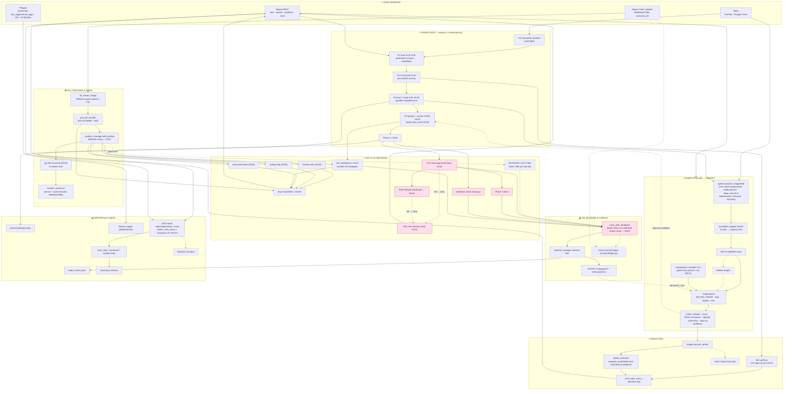

# 230 — System assessment: why we're losing, the multi-day verdict, and an exit-strategy brainstorm

**Author**: Claude Opus 4.8
**Date**: 2026-06-02 (Tuesday, post-close)
**Mandate**: Pierce — "run [the trailing-stop experiment], then assess the system… tell me the gaps
plainly. Why are we losing? What stocks day-to-day are winning? Can we create curated strategies for
many specific small subsets of patterns? Brainstorm as long as we can — think higher level (an AI
that can do ___, an algorithm that could do ___, a RAG that stores many strategies). And create a
diagram of the comprehensive data flows and all the various paths."

This is a *thinking* document, not a ship. No live behavior changed. It is meant to be argued with.

---

## 0. The one-paragraph truth

We lose because we win **30% of the time at a ~1.0 win/loss ratio** — that is a negative-expectancy
machine by arithmetic, independent of any single bug. Every rigorous cut keeps saying the same thing:
**our selection buys variance, not expectancy; the durable lever is execution — specifically the
asymmetry of letting winners run while cutting losers.** The multi-day-hold experiment confirms the
inverse: holding past the close (even with a trailing stop, even on liquid names) is a *losing* median
policy. And a segment sweep shows our current features barely separate winners from losers — every
subset is the same lottery. The path forward is not "pick better"; it is **a learned, reactive EXIT
that decides continue-vs-fade intraday**, plus the data/tagging to make pattern-specific play viable.

---

## 1. The trailing-stop multi-day experiment (the thing you asked me to run)

`scripts/simulate_multiday_trailing_exit.py` over the 787 clean entries (split-adjusted forward 1-5d,
anchored at the signal-day **close** = the price we "failed to sell at"). Look-ahead-safe daily trail.

**Baselines (return vs the signal-day close):**
- exit AT d0 close (our ~1-day policy) = **0.0%** by construction
- hold to d5 close (naive) = median **−4.8%**, mean +1.1%, win 38%
- peak ceiling (perfect trail) = median **+11.6%** — the unreachable upper bound

**Trailing-stop sweep (full set, n=787):**

| trail | median | mean | win% | %>+10% | %<−10% |
|---|---|---|---|---|---|
| 10% | −9.4% | −0.2% | 28% | 15% | 20% |
| 20% | −6.8% | +1.0% | 35% | 21% | 43% |
| 30% | −5.7% | +1.5% | 37% | 22% | 41% |
| 40% | −5.0% | +1.6% | 37% | 23% | 40% |

**Verdict: a daily trailing stop does NOT beat selling at the close.** Every trail width has a
**negative median** and a **<40% win rate**; the mean is barely positive (tail-driven). Tight trails
get whipsawed out on day-1 volatility; wide trails give back the spike. On the liquid subset
(base ≥ $1, n=577) it's marginally less bad (median −3.7% to −7.5%, mean +0.8–2.2%) but **still a
losing median.** The only glimmer is MFCS>0.55 (median +1.7%, win 54%) — but n=26 and the trail adds
nothing there over hold-to-close (those winners just run).

**Why no fixed multi-day policy works** — the peak-timing histogram:

| peak on… | d1 | d2 | d3 | d4 | d5 |
|---|---|---|---|---|---|
| share | **41%** | 19% | 13% | 11% | 15% |

41% of names make their 5-day high on **day 1**, yet the median peak *magnitude* grows from +3.8%
(d1) to +11.6% (d5). So for ~⅖ of names the right move is "exit day 1"; for the rest a bigger high
comes later — **but you can't tell which in advance, and holding for the later peak means surviving
drawdowns that stop you out.** The exit is irreducibly *conditional*. This is the whole problem in one
table, and it's why the answer is a classifier, not a constant.

---

## 2. Gap assessment — why are we losing, plainly

### 2.1 The arithmetic of the loss (realized, n=53 trades, 18 sessions)
- **Total realized −$5,467. Win rate 30% (16W / 27L). Avg win $473 / avg loss $483 → win-loss ratio 0.98.**
- Break-even at a 30% hit rate requires a **>2.3:1** win/loss ratio. We run **~1:1**. That gap *is* the loss.
- Median trade ≈ −$13 (most trades are ~flat); P&L is tail-driven both ways. The **loss tail is bigger**:
  LIDR alone was ≈ −$6,100 across 4/27-28; CMND −$1,705. Winners: APPS (+$1,426, +$1,810), LFS +$1,403.
- **Deliberate same-day exits: −$3,829, win 26%. Accidental overnight carries: −$1,639, win 39%.** Our
  *deliberate exits win less often than our accidents* — the clearest possible signal that **our exit
  timing destroys edge** (we sell winners early and hold losers into stops).

### 2.2 The three structural reasons (each independently sufficient to lose)
1. **Selection is variance, not expectancy.** Proven repeatedly (docs 198/213-215, and §2.3 below). MFCS
   is ~uncorrelated-to-inverted with forward continuation. We pick *volatile*, not *winning*.
2. **Exits give back the edge.** Peak +11.6% exists; we keep −5%. The round-trip is the killer. Fixed
   rules (tranche/trail/D122) can't time the conditional continue-vs-fade moment.
3. **The blind funnel (doc 177).** The news agent times out → EMPTY in ~⅔ of evals → catalyst/news gates
   block on *data absence*, so the bot vetoes its best ideas and trades its 6th-best. We trade a
   degraded subset of our own watchlist.

Plus the recurring **phantom/qty-drift bug class** (docs 226-229) that *manufactured* fake P&L and
poisoned the Kelly/BOCPD corpus — now largely closed, but it distorted every prior "what works" read.

### 2.3 What's winning day-to-day, and is curation viable?
A segment sweep of the 787-entry forward dataset (peak = opportunity ceiling, close = what you keep):

| cut | best segment | peak_d5 | close_d5 | note |
|---|---|---|---|---|
| RVOL | (20,50] moderate | +15% | −0% | extreme RVOL>50 is WORST (+9%/−9%) — exhaustion, confirms doc-198 |
| price | >$10 | +11% | −0% | pennies (<$1) decay hardest (close −10%) |
| MFCS | >0.55 (n=26) | +15% | +2% | only bucket that *keeps* gains; too thin to bank |
| gap | all classes | ~+11% | −3% to −7% | **no separation** |

**The uncomfortable headline: the subsets are nearly homogeneous** — median peak ~+12%, median close
~−5% almost everywhere. **Our current features do not separate winners from losers.** Mild real signals
exist (moderate-not-extreme RVOL, higher price, MFCS>0.55), all consistent with prior findings, none
strong enough alone. **So curated strategies are viable only if we get features that actually separate**
— and right now we don't log them. Worse: `trade_results` tags **catalyst_type = "unknown" for all 53
trades** — we literally cannot measure per-catalyst performance, the precondition for a strategy library.

---

## 3. The comprehensive data-flow diagram (all paths)

> Solid = live path; **dashed = dormant / flag-gated** (debate OFF, fade-short OFF, Operator OFF,
> ledger shadow-only). Red-tinted = the close/booking paths hardened in docs 216-229.

**Reading the diagram — the structurally fragile seams** (where money has leaked):
- The **WS → FSB → PFH → PM** chain is where the D218/D227 qty-drift ghost lived (entry-fill tracking).
- The **five close paths** (D76, D242, D91, shutdown, Phase 4) all funnel into `close_with_attribution`,
  which is now the single phantom-guard chokepoint (only books on confirmed broker close — doc 229).
- **Dormant power**: the event-sourced ledger (would make phantom P&L structurally impossible) and the
  Operator (live co-pilot) are built but off; debate and fade-short are flag-gated off.

> **⚠️ Config reality — verify the env override, never the settings.py default.** This is the single
> most recurring trap in this codebase (doc 93, 176, 178). The live truths, confirmed from `.env` +
> `~/momentum-x-secrets.env` this session:
> - **Max positions = 8** (`EXEC_MAX_POSITIONS=8`), NOT the settings.py default of 3.
> - **Debate is OFF** (`max_debate_attempts=0`, "D100: debate killed, 0% conversion") — the inline
>   "debate enabled" the code suggests is overridden to never fire.
> - **BAR-1 exit is OFF** (`bar1_exit_enabled=False`) — positions are NOT force-closed at T+60s; they
>   carry to D86/D91/D76/D122. (An architecture sweep mis-flagged BAR-1 and "max 3" by reading the
>   un-overridden defaults — exactly the trap. Hence this callout.)
> - **ELITE-press sizing OFF**, **RVOL-exhaustion penalty ON** (docs 199/200).

**A real tension worth flagging (the doc-69 ghost):** the live code at `main.py:5020` carries the
comment *"BAR-1 loses −$5K on actual prod trades; T+1 hold yields +$23K incremental on same trade
pool"* — an **old internal claim that holding to next-day HELPS**, which is *why BAR-1 was disabled*.
That directly contradicts my n=787 split-adjusted result (holding is negative-median). The most
likely reconciliation: doc-69's "+$23K" was a **mean on a tail-heavy pool** — the exact mean-vs-median
/ outlier trap that doc 229 caught inflating the multi-day mean +12.0% → +1.2%. It is *also* possible
it was a different regime (March). Either way it should be **re-run with no-cap + CI + split-adjustment
before it's trusted** — and it's a clean example of why §4.F makes validation law.

---

## 4. The brainstorm — higher-level, "what would it take"

Framed exactly as you asked: *an AI that can do ___ / an algorithm that could do ___ / a RAG that ___*.
I don't have the answer; these are the bets worth arguing about, ranked by expected ROI given §1-2.

### 4.A The reframe (the spine of everything below)
Stop treating EXIT as a fixed rule set and ENTRY as the lever. The data says the opposite:
> **The exit is a recurring binary decision — "from here, does this continue or fade?" — re-evaluated
> every few minutes on a held position. Solve *that* and the 0.98 win/loss ratio becomes 1.5–2.5,
> which flips the whole machine positive without picking a single better stock.**

### 4.B BET #1 — the learned continuation-exit classifier (highest ROI, buildable now)
- **An AI that can:** every N minutes, score `P(continue)` for a held position from its intraday
  microstructure, and map it to an action — *hold* (high), *scale* (decaying), *dump* (fade).
- **The algorithm:** a tabular classifier on labeled intraday features. **TabPFN** (we have the token)
  is almost purpose-built here — a few-shot tabular transformer that excels at small/medium n, which is
  exactly our regime. Gradient-boosting (LightGBM) is the workhorse alternative. Target label =
  "did price make a higher high within the next 30/60 min before breaching X%?" — **constructable today
  from `minute_aggs`** over the whole universe.
- **What it would take:** (1) an intraday feature stream we *mostly* have (minute bars: VWAP distance,
  RVOL decay, range position, gap-fill) plus what we *lack* (tick/L2 order-flow imbalance — a real data
  gap); (2) a labeled training set — **the unlock is that we can label the entire 16,000-ticker × 2-year
  warehouse, not just our 53 trades** (§4.E); (3) wire its output into the existing D122 exit slot as one
  more "strategy," A/B'd against the fixed trail via the scorecard.
- **Why it beats §1's trailing stop:** a fixed trail is *blind*; it can't tell a day-1-peak fader from a
  day-3 runner. A classifier conditions on the live tape — exactly the conditional the peak-timing table
  demands.

### 4.C BET #2 — the curated strategy library + RAG router (your idea, made concrete)
- **A RAG that:** stores `{pattern signature → playbook}` (entry trigger, exit logic, hold horizon,
  sizing, *kill criteria*), and at decision time an AI classifies the live setup's signature and instantly
  retrieves the matching playbook. The MEMORY "Catalyst-Specific Patterns" are the seed: *FDA approval →
  sustained multi-day; earnings-beat+deal → sell-the-news fade; Phase-3 data → 10-15 min dip then buy;
  toxic-lender (Streeterville) → rally sold into.* These ARE distinct, identifiable, exit-differentiated
  archetypes.
- **The architecture:** (a) a **pattern taxonomy** = catalyst type × float bucket × gap class × time-of-
  day × early-tape behavior; (b) per-pattern **playbooks** built from segmented, CI-gated backtests; (c) a
  **retrieval layer** — embed the live setup (catalyst text embedding + structured features) and nearest-
  neighbor into the playbook store, OR a classifier → playbook map; (d) an **LLM classifier** that reads
  the news/catalyst and tags the archetype (we already run news agents — repurpose them to *label*, not
  veto).
- **What it would take — and the hard truths:** (1) **catalyst tagging** end-to-end (we don't even record
  it in outcomes — fix first, it's cheap); (2) **per-pattern sample size** — we trade ~3-6 names/day; a
  "works on 8 FDA names" playbook is a *hypothesis*, not an edge. The library is only as trustworthy as its
  n and CI. (3) **separating features** — §2.3 showed our current ones don't separate; the taxonomy must be
  built on *richer* signatures (catalyst semantics + intraday microstructure), or every "strategy" collapses
  to the same lottery. (4) **continuous re-validation** — every playbook re-tested weekly through the
  Adversary + no-cap/CI discipline, or it rots/overfits (our single most repeated lesson).
- **Honest read:** this is the *right long-horizon architecture*, but it is **gated on closing the
  tagging + feature + sample-size gaps first.** Build BET #1 (exit classifier) before BET #2 (strategy
  library) — #1 needs only labels we can generate today; #2 needs accrued, tagged, validated breadth.

### 4.D The capability map — which AI/algorithm for which sub-problem
| Sub-problem | What would help | Data/edge dependency |
|---|---|---|
| **Entry selection** | continuation classifier on opening-range + RVOL + OFI (docs 187/188) | needs L2/tick (gap); minute partial |
| **Exit** (BET #1) | TabPFN/GBM continuation classifier, re-scored intraday | minute labels (have); tick (gap) |
| **Sizing** | meta-labeling (a 2nd model sizing P(primary correct)); Kelly on a *real* edge | needs a validated primary edge first |
| **Strategy selection** (BET #2) | RAG/router over a CI-gated playbook library | catalyst tagging + per-pattern n (gaps) |
| **Regime** | BOCPD (have) to switch the active library by regime | online; works now |
| **Dilution/halt avoidance** | Finnhub/Polygon offering+halt feed → hard veto | feed not wired (gap) |

### 4.E The biggest unlock — label the whole universe
We keep hitting "n is too small" (53 trades, 26 in the good bucket). But we own a **16,000-ticker × 2-year
daily warehouse + full-universe minute bars.** We can construct a *massive* labeled dataset of "momentum
event (gap/RVOL trigger) → forward intraday + multi-day path" for the **entire market**, not just our
trades. That is the training corpus for both BET #1 and BET #2, and it sidesteps the small-n problem
entirely. **The bottleneck is no longer data acquisition — it's feature/label engineering on the warehouse
we already have.** The aftermath-catalog pipeline (18,234 events, doc 229) is the first 10% of this.

### 4.F The honest dependency chain (what gates all of it)
1. **DATA**: intraday microstructure (have minute; lack tick/L2/OFI); catalyst tagging (missing); dilution/
   halt feed (missing); clean labels (buildable from the warehouse — the unlock).
2. **SAMPLE SIZE**: per-pattern n is the binding constraint for BET #2; the universe-labeling (§4.E) is the
   only credible way to get there.
3. **VALIDATION**: no-cap + Wilson CI + Adversary on every claimed edge, or it's overfit. We have burned
   ourselves on this (MFCS-anti-predictive, the split phantoms) enough times to make it law.
4. **EXECUTION INTEGRITY**: none of this matters if phantom P&L poisons the corpus — which is why the
   216-229 close-path hardening + the event-sourced ledger cutover come *before* we trust any learned edge.

### 4.G Near-term, cheap experiments (to make the abstract concrete)
1. **Label the eval corpus with intraday continuation outcomes from `minute_aggs`** → train a TabPFN exit
   classifier → backtest "exit when P(continue) drops" vs the fixed trail (direct test of BET #1).
2. **Tag catalyst type** from the journal's news headlines (LLM label) → re-run §2.3 segmentation by
   catalyst → measure whether FDA/earnings/dilution archetypes *actually* separate (BET #2 viability test
   on richer features).
3. **Wire a dilution/halt veto** (Finnhub offering calendar) — cheapest standalone risk-reducer for the
   sub-$1 names that decay hardest.

---

## 5. The plain-spoken bottom line
- **We lose because 30% × 1.0 is negative, and our exits make it worse than doing nothing.**
- **Holding multi-day is not the fix** — it's a losing median even with a trailing stop. The "skyrocket"
  was mostly split artifacts + memory bias (doc 229).
- **The fix is a learned, reactive EXIT** (BET #1) — buildable now from data we own — and, longer-horizon,
  **a CI-gated curated strategy library/RAG** (BET #2) once we close the tagging + feature + sample gaps.
- **Selection is not where the 5% lives. Execution is.** Everything in this doc points the same way.

*Decisions for Pierce: which bet to prototype first (I'd start BET #1 — exit classifier on universe-labeled
minute data), and whether to fund the catalyst-tagging + dilution-feed plumbing that BET #2 needs.*

**Initiator**: Claude Opus 4.8 (1M ctx). **Basis**: the trailing-stop experiment + the n=53 realized
truth + the 787/18,234-event forward datasets (doc 229). **Predecessors**: 198 (selection study), 187/188
(continuation signature), 213-215 (no-cap/CI methodology), 226-229 (the phantom sweep + multi-day data).
