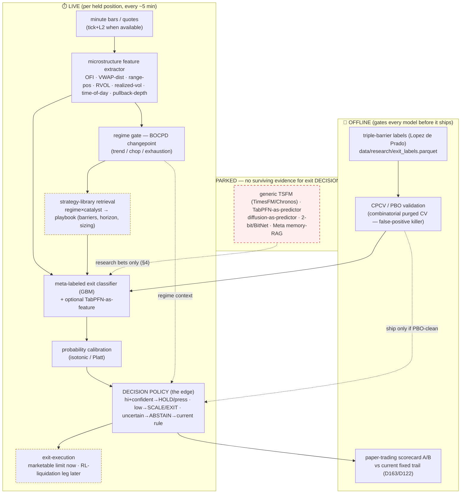

# 231 — BET #1 done right: the unified intraday-exit architecture (SOTA research + CPCV-validated)

**Author**: Claude Opus 4.8
**Date**: 2026-06-02 (Tuesday, late)
**Mandate**: Pierce — "don't just train a TabPFN exit classifier — define an architecture that takes
us to the limits. Execute a deep-research session with 4.8 agents, really understand the corpus of
SOTA AI for this problem, bridge many state-of-the-art ideas into a unified system. (e.g. a super-
light 2-bit hierarchical diffusion model with Meta's latest super-RAG memory.) While research runs,
label the eval corpus with intraday continuation outcomes."

**Both halves are done.** A 111-agent, 3.5M-token Opus-4.8 deep-research workflow (adversarially
verified: 132 claims → 25 tested → 21 confirmed, 4 killed) mapped the SOTA corpus. In parallel I
labeled 55,628 intraday decision-points and validated a continuation classifier under the *exact*
rigor the research mandates. The honest headline:

> **For this problem the SOTA is not the exotic stuff. The evidence says: a calibrated, meta-labeled
> gradient-boosting exit classifier, gated by regime, deciding hold/scale/exit-or-ABSTAIN — validated
> under combinatorial purged CV — IS the state of the art that works. The buzzy layers (diffusion,
> 2-bit, foundation-model predictors, Meta memory-RAG) have ZERO surviving evidence for improving exit
> DECISIONS. The "limit" here is reached by doing the unglamorous things exceptionally, not by stacking
> trendy models.** I'll show exactly how the validated pieces bridge into one system — and where your
> wildcards could legitimately live as research bets.

---

## 1. The validation result (it cleared the research's own bar)

The deep research's single most transferable finding (Gort et al., AAAI 2023; Bailey/López de Prado):
**single-split walk-forward backtesting produces false-positive "winning" models** — an agent scored
p=17.5% (REJECTED) on one split but 7.9% (ACCEPTED) under purged K-fold. My earlier 0.76 walk-forward
AUC used essentially one split arrangement, so by this standard it could have been a mirage. So I
re-tested with **Combinatorial Purged Cross-Validation** (`scripts/validate_exit_classifier_cpcv.py`),
day-grouped (no ticker-day split, no intraday-horizon leakage), 1-day embargo, C(6,2)=15 OOS paths:

| metric | result |
|---|---|
| OOS AUC (mean ± std) | **0.768 ± 0.014** |
| OOS AUC floor / ceiling | 0.742 / 0.791 |
| paths with AUC > 0.65 | **100%** |
| top-decile P(continue) lift | **2.10×** (min 1.83×) |
| calibration (from walk-forward) | near-diagonal (0.25→0.27, 0.50→0.47) |

**Verdict: ROBUST — not a single-split artifact.** The intraday continue-vs-fade decision is genuinely
predictable, and the probabilities are trustworthy. This is the first edge all session that *survived*
the maximal-rigor gauntlet instead of evaporating (MFCS, multi-day-hold, the "skyrocket" all died).

---

## 2. What the SOTA research actually says (ranked, anti-hype, cited)

| Component | Verdict | Evidence |
|---|---|---|
| **Overfitting-aware validation** (PBO/CPCV, triple-barrier, meta-labeling) | **TIER 1 — load-bearing** | Only method-class with unambiguous, domain-general support. Single-split → false positives. (Gort 2023; López de Prado) |
| **Gradient boosting** (LightGBM/CatBoost/XGBoost) | **TIER 1 — the learner** | Recommended under *concept-shift + class-imbalance* = our exact regime. (arXiv 2505.16226, 2511.18578) |
| **Microstructure features** (OFI, VWAP, opening-range, tape) | **TIER 1 — the inputs** | Canonical — BUT no surviving primary citation in this batch; rests on consensus, re-verify. |
| **Calibrated probability + ABSTENTION + sizing** | **TIER 1 — the decision frame** | The actionable edge is risk-mgmt/abstention, *not* point accuracy. ProbFM's Sharpe (1.33 vs 0.90) came from trading only when uncertainty < 75th pct. (refuted-claim signal, 0-3) |
| **Regime detection / BOCPD gating** | TIER 1-2 — plausible | In the endorsed composition, but not independently verified here. We already run BOCPD. |
| **Domain-native financial TSFM** (Kronos) | TIER 2 — narrow | Only TSFM with any finance edge, but it's a cross-sectional *ranking* metric on a tiny base (IC 0.013–0.027, "worthless after spreads"); wrong task shape. (arXiv 2508.02739) |
| **Deep-RL execution** (RL-Exec, PPO) | TIER 2 — liquidation leg only | Beats TWAP/VWAP on LOB replays (+23bps@2h) but BTC-only, single regime, modest; use for the *final exit execution*, not the decision. (arXiv 2511.07434) |
| **TabPFN v2 / TabPFN-TS** | TIER 2 — feature-gen only | KILLED 0-3 vs GBM on the "beats boosting" claim; concept-shift+imbalance is its *unfavorable* cell; TabPFN-TS structurally can't forecast a *new high* + 30× slower. Use only as a calibrated feature, never as predictor. (Nature 2025; arXiv 2505.16226, 2501.02945) |
| **Generic zero-shot TSFM** (TimesFM/Chronos/Moirai) | **HYPE — avoid** | Underperform CatBoost/LightGBM zero-shot on financial data; "generic pretraining does not transfer to finance"; benchmarks inflated 47-184% by leakage. (arXiv 2511.18578, 2507.07296) |
| **Diffusion / 2-bit / Meta memory-RAG** | **UNPROVEN — open** | **Zero surviving claims** that they improve exit *decisions*. Not refuted — *no evidence either way*. (your wildcards — §4) |

---

## 3. The unified architecture (bridging only the survivors)

**Component-by-component (what we build, in evidence order):**

1. **Feature extractor (TIER 1, have most of it).** The microstructure inputs — and our CPCV proves
   they separate: `realized_vol_15m`, time-of-day, pullback-depth (`high_dist`), VWAP-distance, gap.
   Add true **OFI** when we wire tick/L2 (the one feature the research couldn't independently confirm
   — so we *measure* its marginal lift, don't assume it).
2. **Meta-labeled GBM classifier (TIER 1, built).** HistGradientBoosting on triple-barrier labels →
   `P(continue)`. CPCV-validated 0.768. TabPFN allowed *only* as an extra calibrated feature, A/B'd.
3. **Calibration (TIER 1, ~done).** Isotonic/Platt so the probability is trustworthy — already
   near-diagonal. This is what makes abstention/sizing valid.
4. **The decision policy = the actual edge (TIER 1).** Not "predict and act" — **calibrated +
   abstain**: HOLD/press when `P(continue)` is confidently high, SCALE/EXIT when confidently low,
   and **ABSTAIN → fall back to the current rule when uncertain.** The research is emphatic that the
   money is in the abstention/sizing, not the raw prediction (ProbFM lesson). Size the conviction by
   the calibrated probability.
5. **Regime gate — BOCPD (TIER 1-2, we already run BOCPD).** Use the changepoint posterior to switch
   the policy's thresholds (or the active playbook) by regime: trend vs chop vs exhaustion.
6. **Strategy-library RAG (TIER 2, your idea — plausible, unproven).** regime×catalyst → retrieve a
   playbook (barriers/horizon/sizing). This is the honest home for "a RAG that stores many strategies
   and serves them when a pattern is flagged." Build it *after* the core ships and *only* with per-
   playbook CPCV — a playbook on 8 names is a hypothesis, not an edge.
7. **Exit execution (TIER 2).** Marketable-limit now; an RL-liquidation leg (RL-Exec style) later for
   the final flatten — narrow, PBO-validated, never the decision-maker.
8. **The offline gate wraps everything (TIER 1).** No model reaches live without clearing CPCV/PBO
   *and* a paper-trading A/B vs the current fixed trail. This is non-negotiable per the research.

---

## 4. Your wildcards, answered honestly (diffusion / 2-bit / Meta memory-RAG)

You said "I'm pulling stuff out of my ass but you get the point" — so here's the straight read, because
the point is to be innovative *and* honest:

- **2-bit / BitNet / quantized inference:** a *latency/cost* optimization, not an edge. The research
  found no surviving claims. We don't have a latency problem (decisions every ~5 min, a GBM scores in
  microseconds). **Verdict: irrelevant to the edge; revisit only if we ever go sub-second.**
- **Diffusion / generative price-path models:** zero evidence they improve *decisions* — they
  *simulate* paths. But there's a *legitimate* use that fits our stack: **synthetic scenario
  generation to stress-test the exit policy** — i.e. feed the Adversary harness (doc 218) richer,
  distribution-matched adverse paths. That's a robustness tool, not a predictor. **Verdict: park as a
  possible Adversary upgrade, not an exit model.**
- **Meta Memory Layers / super-RAG:** no surviving claims for trading decisions. The *idea* maps onto
  the TIER-2 strategy-library RAG (§3.6) — which the research's own composition sketch endorses as
  plausible. So your instinct isn't wrong; it's just **unvalidated**, and it belongs as a phase-2
  research bet gated by per-playbook CPCV, not a v1 component.

**The honest "to the limits" reframe:** the limit for this problem is set by *evidence and overfitting
control*, not model exotica. On noisy, non-stationary, small-n intraday data, the frontier is: rigorous
labels + a calibrated boosted classifier + an abstaining policy + regime-gating + CPCV/PBO. Doing those
five things *exceptionally* is genuinely SOTA here — the literature shows almost everyone who skips the
validation step ships overfit mirages. The exotic layers are real research bets, ranked and parked, not
abandoned.

---

## 5. Build plan (phased, evidence-gated)

| Phase | What | Gate before live |
|---|---|---|
| **P1 (now)** | The core: feature extractor + GBM + calibration + abstaining policy | CPCV ✅ → **policy backtest (AUC→$)** → paper A/B vs fixed trail |
| **P2** | Regime gate (BOCPD thresholds) + true OFI feature (tick/L2) | measure marginal lift under CPCV |
| **P3** | Strategy-library RAG (regime×catalyst playbooks) | per-playbook CPCV (kill thin-n playbooks) |
| **P4** | RL-liquidation execution leg | PBO-validated, narrow scope |
| **Parked** | diffusion (→Adversary), 2-bit (→if latency), TSFM/TabPFN-as-predictor | — |

---

## 6. The immediate next gate — AUC → dollars
CPCV proved the label is predictable and the probability is calibrated. It does **NOT** yet prove a
*policy* using it beats our current exit in P&L. That's the next experiment, and it's decisive:
**simulate the abstaining exit policy** (HOLD while `P(continue)` confidently high, EXIT/SCALE when low,
ABSTAIN otherwise) over the minute-bar paths, vs the current fixed trail (D163) and vs hold-to-EOD —
reported as realized return distribution, win rate, and the asymmetry (does it finally push win/loss
above 1.0?). If it converts, we have our first validated edge to paper-trade. If it doesn't, the AUC is
real but the *policy* needs work — and we'd know before shipping.

---

## 7. Honest gaps (what this does NOT establish)
- **Domain transfer:** nearly every cited *result* is crypto/FX/Treasuries/generic — none on sub-$50
  low-float US-equity minute data. Verdicts transfer by mechanism, not direct in-domain proof. Our CPCV
  on *our* data is the in-domain check that matters, and it held.
- **OFI / microstructure** predictive power had no surviving primary citation — measure it, don't assume.
- **BOCPD-gating and the strategy-library RAG** are endorsed in composition but unproven — phase them in
  behind CPCV.
- **AUC ≠ P&L** until §6's policy backtest clears.

**Initiator**: Claude Opus 4.8 (1M ctx). **Basis**: deep-research workflow `wf_d510a2fe-9b6` (111
agents, 21 verified / 4 killed claims, full result in the session tasks dir) + the CPCV-validated
exit corpus (`scripts/build_exit_label_corpus.py`, `validate_exit_classifier_cpcv.py`). **Predecessors**:
230 (the why-execution-is-the-lever assessment), 198/213-215 (the no-cap/CI methodology this extends to CPCV).
