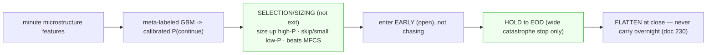

# 232 — The AUC→dollars gate: exit-trigger FAILS, conviction-filter WORKS (the BET#1 pivot)

**Author**: Claude Opus 4.8
**Date**: 2026-06-02 (Tuesday, late)
**Mandate**: Pierce — "Let's run it!" (the decisive policy backtest from doc 231 §6).

The CPCV-validated continuation classifier (AUC 0.768, doc 231) faced the only test that matters:
**does a policy that uses it make more money than our current exit?** The answer is a clean,
honest, *useful* surprise — and it reshapes BET #1.

---

## 0. TL;DR
- **As an early-EXIT trigger: it FAILS.** Adding "exit when P(continue) is low" on top of the trail
  *lost* money vs the trail alone (−0.83pp/trade) and lost on the median too. Early exits cap the
  right-tail winners (avg winner +25%) more than they save on losers. **AUC ≠ P&L, again.**
- **As a CONVICTION / SELECTION filter: it WORKS.** Names with high *early* P(continue) returned
  **+14.7% mean hold-to-EOD vs +4.7% for low** (monotonic; top-quartile = **1.75×** the average) —
  and it **beats MFCS**, which is non-monotonic (our selector is still variance, not signal).
- **The dominant lever is HOLD-to-EOD, not smarter exits** — confirming doc 230. Every early-exit
  mechanism (trail or model) underperformed simply holding to the close.
- **The pivot:** P(continue) is not an exit trigger — it's a **calibrated selection/sizing signal**
  (exactly the use the doc-231 research endorsed). The validated strategy to paper-test: **enter
  early → size by P(continue) → hold to EOD → flatten at the close** (never carry overnight, per 230).

---

## 1. The policy backtest (leakage-free A/B)
`scripts/backtest_exit_policy.py` — entry held constant (long at the first RTH decision point of each
of 893 eval ticker-days, so only the EXIT differs), P(continue) from **out-of-fold** predictions
(purged K-fold by day-group). The model is an *overlay* on the trail: exit on (trail breach) OR
(P(continue) < τ_exit) — the abstaining policy, with the trail as the fallback when the model is
uncertain.

| policy | median | mean | win% | avg win | avg loss | **W/L** |
|---|---|---|---|---|---|---|
| **HOLD-to-EOD** | +1.4% | **+9.6%** | 55% | +25.1% | −9.7% | **2.60** |
| TRAIL-only (20%) | +0.4% | +6.9% | 52% | +20.9% | −8.4% | 2.49 |
| MODEL overlay (best τ_exit=0.10) | +0.1% | +6.1% | 51% | +18.7% | −7.3% | 2.55 |
| MODEL overlay (τ_exit=0.30) | +0.0% | +4.4% | 49% | +15.3% | −6.2% | 2.48 |

**Ranking: HOLD > TRAIL > every MODEL overlay**, on mean *and* median. The harder the model exits
(higher τ_exit, tighter), the worse it does. Verdict: **the exit overlay does NOT convert.**

**Why it fails (the objective mismatch):** the label was "+5% before −5% within 30 min." A name that
won't pop in the next 30 min isn't necessarily a loser — it may drift, or run big on a longer horizon.
Exiting it forgoes the right tail. Optimizing a 30-min ±5% barrier ≠ optimizing total return. The
classifier is *correct* about 30-min continuation (0.768 AUC) and *wrong tool* for the exit trigger.

## 2. The conviction-filter finding (the constructive flip)
Same OOS P(continue), but used as the research intended — a *selection* signal. For each ticker-day,
take the **early-session** P(continue) (first ~3 decision points, 9:35–9:45) and look at the
**hold-to-EOD** outcome:

| early P(continue) | n | median | mean | win% | W/L |
|---|---|---|---|---|---|
| low | 296 | +0.0% | +4.7% | 51% | 2.79 |
| mid | 295 | +3.8% | +9.5% | 58% | 2.18 |
| **high** | 296 | +3.2% | **+14.7%** | 57% | 2.75 |
| **top quartile** | 222 | — | **+16.9%** (1.75× all) | — | — |

**Monotonic and strong.** vs the same cut by **MFCS** (our current selector):

| MFCS | median | mean | win% |
|---|---|---|---|
| low | +1.3% | +12.8% | 56% |
| mid | +1.1% | +7.2% | 54% |
| high | +2.2% | +9.0% | 56% |

**MFCS is non-monotonic** — the *low* bucket has the highest mean. Our live conviction score does not
separate hold-to-EOD outcomes; the model's early read does. **P(continue)-as-conviction beats
MFCS-as-conviction.**

## 3. What this means for the architecture (doc 231 update)
The doc-231 spine stands, but the model's **role moves** from the exit trigger to the conviction/sizing
input — which is precisely where the deep research said the edge lives ("the actionable edge is
risk-management/abstention/sizing, not the prediction"). Revised composition:

The strategy hypothesis the data supports (and that inverts what we do live — enter late, exit early,
size by MFCS): **enter early → size by P(continue) → hold to EOD → flatten at the close.**

## 4. Honest caveats (what this does NOT yet prove)
- **Idealized/frictionless:** enter all 893 names at the 9:35 close, equal weight, no spread/slippage,
  unlimited capital. The **absolute** +9.6%/+14.7% are upper bounds; the **relative** findings
  (conviction monotonic; exit-overlay hurts; hold > trail) are robust to friction (it hits all policies
  alike). Do **not** read +14.7% as a deployable return.
- **Tail-driven means:** medians are far lower (+1.4% hold, +3.2% high-conviction). Real, but modest at
  the median; the upside is in the right tail you must *hold* to capture.
- **Same-day only:** "hold-to-EOD beats early exit" is INTRADAY. doc 230 showed *overnight* carry is
  negative — so the rule is hold-to-**close**, then flatten. The two findings reconcile cleanly.
- **One dataset, one label:** OOS-predicted but Feb–Jun 2026 only; needs a realism layer (spread/
  slippage/capital cap) and forward paper validation before sizing real conviction on it.
- **early_p partly encodes early momentum** — fine (it's a learned, monotonic, MFCS-beating blend), but
  it means the signal is "early strength persists," not magic; treat it as a better momentum-conviction
  score, not an oracle.

## 5. Next gates (in order)
1. **Realism pass:** re-run the conviction-filter backtest with spread/slippage + a capital cap
   (top-N by P(continue) per day, position-sized) → a *deployable* return estimate.
2. **Selection backtest:** "enter only top-quartile P(continue), size by it, hold-to-EOD" vs our actual
   live policy on the same days → does it beat what we did?
3. **If it survives:** paper-trade the conviction-sizing + hold-to-EOD policy in shadow (no live change
   until the scorecard confirms), validated under CPCV/PBO.

**The one-line takeaway:** BET #1's model is real and valuable — **not as the exit brain we assumed, but
as a better conviction/sizing signal than MFCS, paired with the boring lever that keeps winning in every
experiment: hold to the close instead of exiting early.**

**Initiator**: Claude Opus 4.8 (1M ctx). **Basis**: `scripts/backtest_exit_policy.py` + the conviction
analysis, on the CPCV-validated OOS classifier (doc 231). **Predecessors**: 231 (the validated classifier
+ SOTA architecture), 230 (exits-destroy-edge / hold-longer), 198 (MFCS is anti-predictive).
